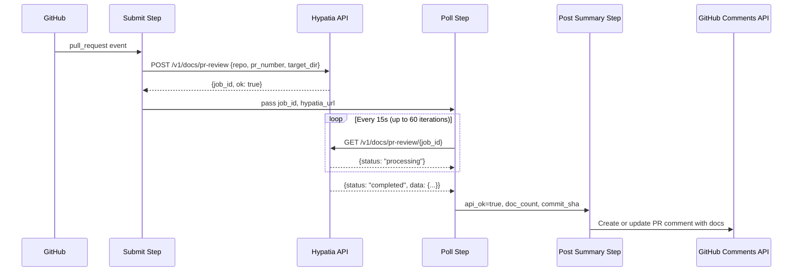
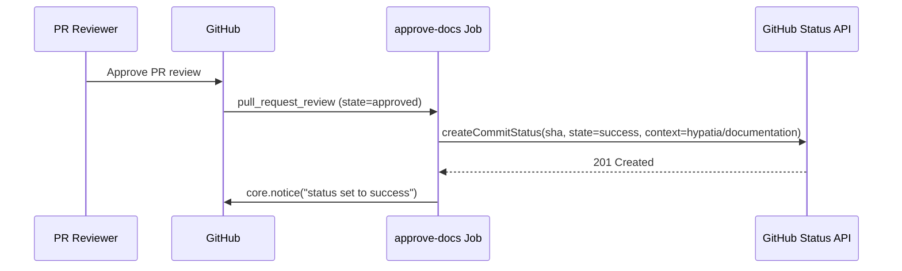
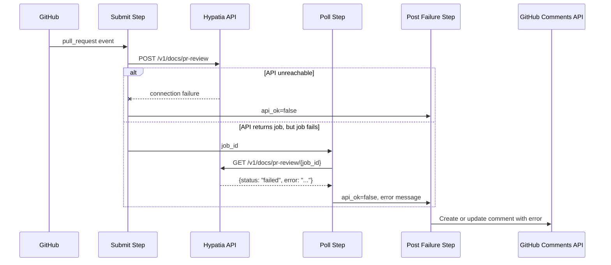

# Workflows — Design Reference

## Module Overview

This module defines a GitHub Actions workflow (`doc-generation.yml`) that integrates the Hypatia documentation service into the pull request lifecycle of the `opa-psm2-tests` repository. The workflow contains two jobs: `generate-docs`, which submits PR metadata to an external Hypatia API, polls for completion, and posts generated documentation content as a PR comment; and `approve-docs`, which transitions a commit status check from pending to success when a PR review is approved, thereby gating merge on human review of the generated documentation. The workflow uses concurrency controls to ensure only one documentation generation run is active per PR at any time.

## Component Diagram

```mermaid
componentDiagram
  component "GitHub PR Events" as events
  component "generate-docs Job" as genjob
  component "Submit Step" as submit
  component "Poll Step" as poll
  component "Post Summary Step" as summary
  component "Post Failure Step" as failure
  component "approve-docs Job" as approve
  component "Hypatia API" as hypatia
  component "GitHub Commit Status API" as statusapi
  component "GitHub Issues/Comments API" as commentsapi

  events --> genjob : "pull_request (opened/synchronize)"
  events --> approve : "pull_request_review (approved)"
  genjob --> submit
  submit --> hypatia : "POST /v1/docs/pr-review"
  submit --> poll
  poll --> hypatia : "GET /v1/docs/pr-review/{job_id}"
  poll --> summary : "on success"
  poll --> failure : "on failure/timeout"
  summary --> commentsapi : "create/update comment"
  failure --> commentsapi : "create/update comment"
  approve --> statusapi : "set hypatia/documentation = success"
```

## Key Flows

### 1. Documentation Generation on PR Open/Update

When a pull request is opened or synchronized (new commits pushed), the `generate-docs` job fires. It submits the repository name, PR number, and target directory to the Hypatia API, then polls the returned job ID at 15-second intervals for up to 15 minutes. On successful completion, it reads the full response from a temporary file and posts a formatted PR comment containing an impact analysis table and expandable sections with the full content of each generated document.



### 2. Documentation Approval via PR Review

When a reviewer approves the pull request, the `approve-docs` job runs. It reads the head SHA from the PR payload and sets the `hypatia/documentation` commit status to `success`, unblocking any branch protection rules that require this status check to pass before merge.



### 3. Failure / Unreachable API Handling

If the Hypatia API is unreachable during submission, or if the polling step times out or receives a failure status, the workflow posts (or updates) a PR comment indicating that documentation generation is unavailable, optionally including the error message returned by the API.



## Data Model

The workflow does not maintain persistent state. All data flows through GitHub Actions step outputs and a temporary JSON file (`/tmp/hypatia_response.json`). The key data structures are:

| Structure | Location | Fields |
|-----------|----------|--------|
| **Submit outputs** | Step outputs (`submit`) | 'hypatia_url', 'job_id', 'api_ok' |
| **Poll outputs** | Step outputs (`poll`) | 'api_ok', 'doc_count', 'committed', 'commit_sha', 'error', 'done' |
| **Hypatia response** | `/tmp/hypatia_response.json` | 'status', 'ok', 'error', 'data.generated_docs[]', 'data.impact_details[]', 'data.files_committed', 'data.commit_sha', 'data.head_branch' |
| **Generated doc entry** | `data.generated_docs[]` | 'path', 'content', 'content_preview', 'content_length', 'record_id' |
| **Impact detail entry** | `data.impact_details[]` | 'source', 'status', 'additions', 'deletions', 'doc_type', 'target' |

## Dependencies

| Dependency | Purpose | Version |
|------------|---------|---------|
| GitHub Actions runner | Execution environment for workflow jobs | `ubuntu-latest` |
| `actions/github-script` | Execute JavaScript with authenticated Octokit client for GitHub API calls | `v7` |
| `curl` | HTTP client for Hypatia API submission and polling | System default |
| `jq` | JSON parsing of API responses in shell steps | System default |
| Hypatia API (`/v1/docs/pr-review`) | External service that analyzes PRs and generates documentation | N/A (remote service) |
| GitHub REST API (Commit Statuses) | Set `hypatia/documentation` status check on PR head commit | N/A (platform) |
| GitHub REST API (Issue Comments) | Create and update PR comments with documentation results | N/A (platform) |

## Configuration

| Item | Type | Required | Default | Description |
|------|------|----------|---------|-------------|
| `HYPATIA_API_URL` | Repository secret | No | `https://hypatia.cn-agents.com` | Base URL of the Hypatia documentation service |
| `target_dir` | Hardcoded in workflow | N/A | `"docs"` | Directory in the repository where generated docs are committed |
| `dry_run` | Hardcoded in workflow | N/A | `false` | Whether the Hypatia API should skip committing files |
| `concurrency.group` | Workflow setting | N/A | `doc-gen-{pr_number}` | Ensures one generation run per PR; in-progress runs are cancelled |
| `timeout-minutes` | Job setting | N/A | `20` (generate-docs), `5` (approve-docs) | Maximum wall-clock time for each job |
| **Permissions** | Workflow-level | Yes | N/A | Requires `contents: write`, `pull-requests: write`, `statuses: write` |

## Error Handling

The workflow employs a layered, graceful-degradation approach to error handling:

- **API unreachable on submission**: The `curl` command uses `-sf` (silent, fail on HTTP errors) with `--max-time 30` and `--retry 1`. If the request fails, the shell `||` block emits a GitHub Actions `::warning::` annotation, sets `api_ok=false`, and exits cleanly with code 0 — the job does not fail.
- **Polling failures**: Individual poll iterations use `curl -sf` with `--max-time 10`. If a single poll request fails, the `|| continue` construct skips that iteration and retries on the next cycle. This tolerates transient network issues.
- **Polling timeout**: If 60 iterations (15 minutes) elapse without a terminal status (`completed` or `failed`), a `::warning::` is emitted and `api_ok` is set to `false`, triggering the failure comment path.
- **Job-level failure status**: The Hypatia API may return `status: "failed"` with an `error` field. This is captured and forwarded to the failure comment step.
- **Comment idempotency**: Both the success and failure comment steps search for an existing bot comment by marker strings (`'Documentation Generated'`, `'documentation impact'`, `'Documentation generation'`) and update it in place rather than creating duplicates. The search is limited to `per_page: 100`.
- **Actor filtering**: The `generate-docs` job skips runs triggered by `github-actions[bot]` or `scm-bot` to prevent infinite loops when the Hypatia service commits documentation back to the PR branch.

There is no formal exception hierarchy; error propagation relies on step output variables (`api_ok`, `error`) and conditional step execution (`if:` guards).

## Known Limitations / Technical Debt

- **Hardcoded URL**: The default Hypatia API URL (`https://hypatia.cn-agents.com`) is hardcoded in the shell script. If the service endpoint changes, every repository carrying this workflow must either set the secret or update the file.
- **Hardcoded `target_dir` and `dry_run`**: The values `"docs"` and `false` are embedded in the JSON payload with no mechanism for per-repository override without editing the workflow file.
- **Comment search limited to 100**: The `listComments` call uses `per_page: 100` without pagination. On PRs with more than 100 comments, the bot may fail to find its existing comment and create a duplicate.
- **No authentication to Hypatia API**: The `curl` calls to the Hypatia service do not include any authentication token or API key. Access control relies entirely on the service being open or network-restricted.
- **Polling interval is fixed**: The 15-second interval and 60-iteration cap are hardcoded, yielding a maximum wait of ~15 minutes. There is no exponential backoff.
- **Temporary file on shared runner**: The response JSON is written to `/tmp/hypatia_response.json`. While this is acceptable on ephemeral GitHub-hosted runners, it could be a concern on self-hosted runners with concurrent jobs.
- **Missing error handling on `jq` parsing**: If the Hypatia API returns malformed JSON, `jq` will fail silently (output empty strings) rather than surfacing a clear error. The `// empty` and `// false` fallbacks mask parse failures.
- **`approve-docs` has no validation**: The approval step sets the commit status to success unconditionally on any approved review. It does not verify that documentation was actually generated or that the `generate-docs` job completed successfully for the current head SHA.