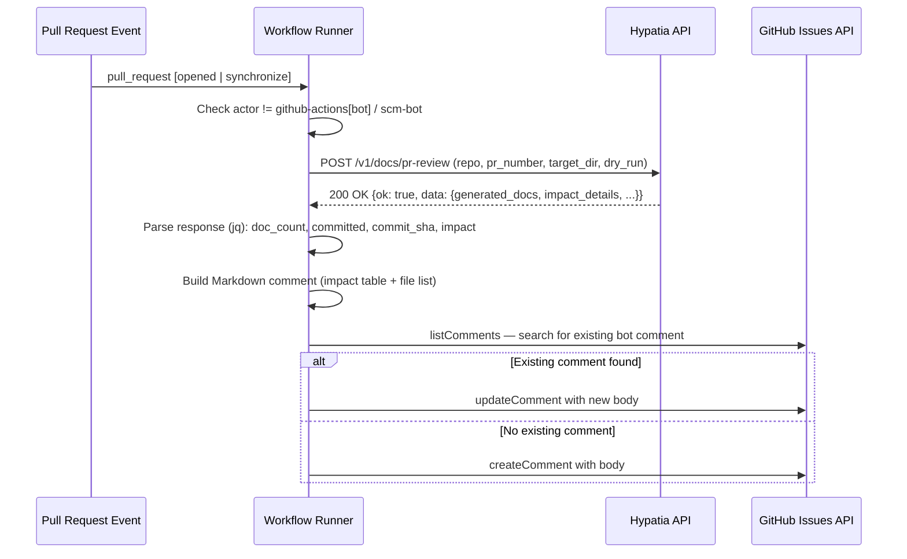
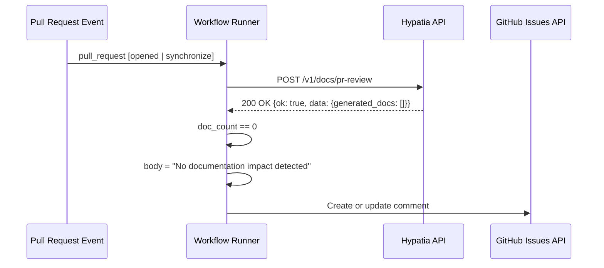
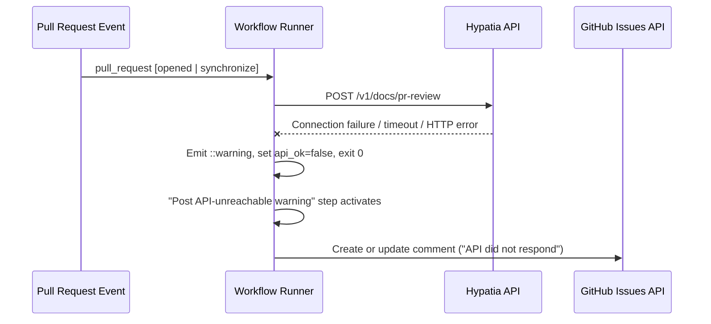

# Workflows — Design Reference

## Module Overview

This module defines a GitHub Actions workflow (`.github/workflows/doc-generation.yml`) that automates documentation generation for the `opa-psm2-tests` repository. When a pull request is opened or updated, the workflow calls the Hypatia external documentation service, which analyzes the PR's changes, generates relevant documentation files, and optionally commits them back to the PR branch. The workflow then posts (or updates) a summary comment on the PR describing the documentation impact, generated files, and commit references. If the Hypatia API is unreachable, the workflow degrades gracefully by posting a warning comment instead of failing the build.

## Component Diagram

```mermaid
component
    [PR Event Trigger] as trigger
    [Concurrency Gate] as concurrency
    [Actor Guard] as guard
    [Hypatia API Call] as api_call
    [Response Parser] as parser
    [Summary Comment Poster] as summary
    [Unreachable Warning Poster] as warning
    [Hypatia Service] as hypatia_ext
    [GitHub Issues API] as gh_issues

    trigger --> concurrency
    concurrency --> guard
    guard --> api_call
    api_call --> hypatia_ext
    api_call --> parser
    parser --> summary
    parser --> warning
    summary --> gh_issues
    warning --> gh_issues
```

## Key Flows

### Flow 1: Successful Documentation Generation

When the Hypatia API responds successfully and documentation is generated, the workflow parses the response, formats an impact table and file list, and posts (or updates) a summary comment on the PR.



### Flow 2: No Documentation Impact

When the Hypatia API responds successfully but determines no documentation changes are needed (doc count is zero), the workflow posts a concise "no impact" comment.



### Flow 3: Hypatia API Unreachable

When the `curl` call to Hypatia fails (network error, timeout, non-2xx status), the workflow sets `api_ok=false`, exits the first step gracefully (exit 0), and a dedicated warning step posts an "API unavailable" comment on the PR.



## Data Model

The workflow does not maintain persistent state. It operates on transient data structures exchanged during a single run:

| Structure | Format | Description |
|---|---|---|
| Hypatia Request Payload | JSON | Contains `repo` (string), `pr_number` (integer), `target_dir` (string, always `"docs"`), and `dry_run` (boolean, always `false`). |
| Hypatia Response | JSON (saved to `/tmp/hypatia_response.json`) | Top-level `ok` (boolean) and `data` object containing `generated_docs` (array of `{path, content_length, record_id}`), `impact_details` (array of `{source, status, additions, deletions, doc_type, target}`), `files_committed` (boolean), `commit_sha` (string), and `impact_summary` (string). |
| Step Outputs | GitHub Actions key-value pairs | `api_ok`, `doc_count`, `committed`, `commit_sha` — passed between the shell step and the JavaScript steps via `$GITHUB_OUTPUT`. |

## Dependencies

| Dependency | Purpose | Version |
|---|---|---|
| `ubuntu-latest` | Runner operating system image | Latest (GitHub-managed) |
| `curl` | HTTP client for calling the Hypatia API | Bundled with runner |
| `jq` | JSON parsing of the Hypatia API response | Bundled with runner |
| `actions/github-script` | Executes inline JavaScript with authenticated Octokit client for PR comment management | v7 |
| Hypatia API (`/v1/docs/pr-review`) | External service that analyzes PR diffs and generates documentation | N/A (remote service) |
| GitHub REST API (Issues/Comments) | Used to list, create, and update PR comments | v3 (via Octokit) |

## Configuration

| Item | Type | Required | Default | Description |
|---|---|---|---|---|
| `HYPATIA_API_URL` | Repository secret | No | `https://hypatia.cn-agents.com` | Base URL of the Hypatia documentation service. If the secret is unset or empty, the default URL is used. |
| `permissions.contents` | Workflow permission | Yes (declared) | `write` | Allows the Hypatia service to commit generated docs back to the PR branch. |
| `permissions.pull-requests` | Workflow permission | Yes (declared) | `write` | Allows the workflow to post and update comments on pull requests. |
| `target_dir` | Hardcoded in request payload | N/A | `"docs"` | The directory within the repository where generated documentation is placed. |
| `dry_run` | Hardcoded in request payload | N/A | `false` | Controls whether Hypatia actually commits files or only reports what would change. |
| `timeout-minutes` | Workflow job setting | N/A | `15` | Maximum wall-clock time for the entire job. |
| `--max-time 600` | curl option | N/A | 600 seconds | Maximum time allowed for the Hypatia API HTTP request. |
| `--retry 1` / `--retry-delay 10` | curl options | N/A | 1 retry, 10s delay | Retry policy for transient HTTP failures. |

## Error Handling

The workflow employs a **graceful degradation** pattern rather than failing the CI run on documentation errors:

1. **API call failure**: The `curl` command uses `-sf` (silent + fail-on-HTTP-error). If the request fails for any reason (network, timeout, HTTP 4xx/5xx), the shell block catches the failure via `|| { ... }`, emits a GitHub Actions `::warning` annotation, sets `api_ok=false`, and exits with code 0 (success). This prevents documentation issues from blocking PR workflows.

2. **Conditional step execution**: The "Post summary comment" step only runs when `api_ok == 'true'`. The "Post API-unreachable warning" step only runs when `api_ok == 'false'`. This branching ensures exactly one comment path executes.

3. **Idempotent comment management**: Both comment-posting steps search for an existing bot comment (by matching known marker strings in the comment body) before deciding whether to create a new comment or update the existing one. This prevents duplicate comments on repeated `synchronize` events.

4. **Actor guard**: The job-level `if` condition excludes `github-actions[bot]` and `scm-bot` actors to prevent infinite loops where a bot commit triggers another workflow run.

5. **Concurrency control**: The `concurrency` block with `cancel-in-progress: true` ensures that rapid successive pushes to a PR cancel stale runs, avoiding race conditions on comment updates.

6. **stderr suppression**: The `curl` command redirects stderr to `/dev/null` (`2>/dev/null`), keeping the workflow log clean of transient connection noise.

## Known Limitations / Technical Debt

1. **Hardcoded `target_dir` and `dry_run`**: The values `"docs"` and `false` are hardcoded in the curl payload (lines 49–50). These should be parameterized as workflow inputs or repository variables to support different repository conventions.

2. **Hardcoded default URL**: The fallback URL `https://hypatia.cn-agents.com` is embedded directly in the shell script. If the service endpoint changes, every repository carrying this workflow must be updated.

3. **Comment search limited to 100 comments**: The `listComments` call uses `per_page: 100` without pagination. On PRs with more than 100 comments, the bot's existing comment may not be found, resulting in a duplicate comment.

4. **No authentication on the Hypatia API call**: The `curl` request does not include an authentication token or API key header. The service appears to rely on the repository name and PR number for authorization context, but there is no explicit credential exchange visible in the workflow.

5. **Temporary file on shared runner**: The response is written to `/tmp/hypatia_response.json` on the runner filesystem. While GitHub-hosted runners are ephemeral, this could be a concern if the workflow is run on self-hosted runners where `/tmp` persists across jobs.

6. **Missing validation of `jq` output**: The parsed fields (`OK`, `DOC_COUNT`, etc.) are not validated for unexpected values. If the API returns a malformed response that `curl` considers successful (HTTP 200 with invalid JSON), `jq` may produce empty or incorrect values that propagate silently into the comment step.

7. **Relative commit link**: The commit SHA link is constructed as `../commit/${commitSha}`, which is a relative URL. This works in GitHub's PR comment rendering context but is fragile and would break if the comment body were rendered elsewhere.