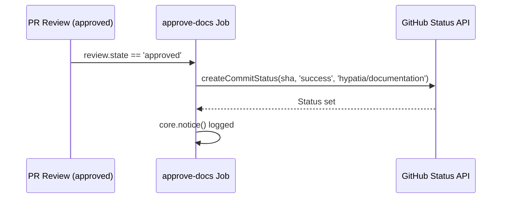
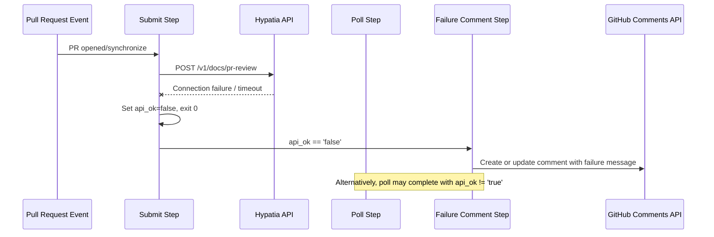

# Workflows — Design Reference

## Module Overview

This module defines a GitHub Actions workflow (`.github/workflows/doc-generation.yml`) that automates documentation generation for the `opa-psm2-tests` repository. When a pull request is opened or updated, the workflow submits a job to an external Hypatia API service, polls for completion, and posts the generated documentation content as a PR comment. It enforces a review gate via the `hypatia/documentation` commit status check: the status remains pending until a reviewer approves the PR, at which point a second job sets the status to success, unblocking merge. The workflow is designed to be portable across repositories within the Cornelis Networks organization.

## Component Diagram

```mermaid
component
    [GitHub PR Events] as Events
    [Concurrency Controller] as Concurrency
    [generate-docs Job] as GenJob
    [Submit Step] as Submit
    [Poll Step] as Poll
    [Summary Comment Step] as Summary
    [Failure Comment Step] as FailComment
    [approve-docs Job] as ApproveJob
    [Hypatia API] as HypatiaAPI
    [GitHub Commit Status API] as StatusAPI
    [GitHub Issues/Comments API] as CommentsAPI

    Events --> Concurrency
    Concurrency --> GenJob
    Concurrency --> ApproveJob
    GenJob --> Submit
    Submit --> HypatiaAPI
    Submit --> Poll
    Poll --> HypatiaAPI
    Poll --> Summary
    Poll --> FailComment
    Summary --> CommentsAPI
    FailComment --> CommentsAPI
    ApproveJob --> StatusAPI
```

## Key Flows

### 1. Documentation Generation on PR Open/Synchronize

This is the primary flow. When a pull request is opened or a new commit is pushed, the `generate-docs` job fires. It submits a POST request to the Hypatia API with the repository name, PR number, and target directory. It then polls the API every 15 seconds (up to 60 iterations / ~15 minutes) until the job completes or fails. On success, it reads the full response from a temporary file and posts a formatted PR comment containing an impact table and expandable sections with the full generated document content. If the API already posted a comment on a previous synchronize event, the existing comment is updated in place rather than creating a duplicate.


### 2. Documentation Approval on PR Review

When a reviewer approves the pull request, the `approve-docs` job runs. It reads the head SHA from the PR payload and sets the `hypatia/documentation` commit status to `success` via the GitHub Commit Status API. This unblocks any branch protection rules that require this status check to pass before merging.



### 3. Failure Handling When API Is Unreachable

If the Hypatia API is unreachable during the submit step, or if the poll step completes without a successful result, the workflow posts (or updates) a failure comment on the PR. The comment includes the error message from the API response if available, or a generic "API did not respond" message. This ensures the PR author always receives feedback regardless of API availability.



## Data Model

The workflow does not maintain persistent state. All data flows through GitHub Actions step outputs and a temporary JSON file. The key data structures are:

| Structure | Location | Description |
|---|---|---|
| Submit outputs | `steps.submit.outputs` | Contains `hypatia_url`, `api_ok`, and `job_id` extracted from the Hypatia API POST response. |
| Poll outputs | `steps.poll.outputs` | Contains `api_ok`, `doc_count`, `committed`, `commit_sha`, `error`, and `done` extracted from the polling GET response. |
| Hypatia response JSON | `/tmp/hypatia_response.json` | Full API response written during polling, read by the summary step. Contains `data.generated_docs[]` (each with `path`, `content`, `content_length`, `record_id`) and `data.impact_details[]` (each with `source`, `status`, `additions`, `deletions`, `doc_type`, `target`). |
| PR comment body | GitHub Issues API | Markdown-formatted string with impact table and expandable `<details>` sections per generated document. Identified by marker strings for idempotent update. |

## Dependencies

| Dependency | Purpose | Version |
|---|---|---|
| GitHub Actions runner | Execution environment for workflow jobs | `ubuntu-latest` |
| `actions/github-script` | Execute JavaScript with authenticated Octokit client for GitHub API calls | `v7` |
| `curl` | HTTP client for Hypatia API requests (submit and poll) | System default |
| `jq` | JSON parsing of API responses in shell steps | System default |
| Hypatia API (`hemingway.cn-agents.com`) | External service that analyzes PR diffs and generates documentation | `/v1/docs/pr-review` |
| GitHub REST API (Commit Statuses) | Set `hypatia/documentation` status check on PR head commit | Octokit via `actions/github-script` |
| GitHub REST API (Issues/Comments) | Create and update PR comments with generated documentation | Octokit via `actions/github-script` |

## Configuration

| Item | Type | Required | Default | Description |
|---|---|---|---|---|
| `HYPATIA_API_URL` | Repository secret | No | `https://hemingway.cn-agents.com` | Base URL of the Hypatia documentation generation API. |
| `permissions.contents` | Workflow permission | Yes | `write` | Required for potential branch operations. |
| `permissions.pull-requests` | Workflow permission | Yes | `write` | Required to post and update PR comments. |
| `permissions.statuses` | Workflow permission | Yes | `write` | Required to set commit status checks. |
| `concurrency.group` | Workflow setting | Yes | `doc-gen-{pr_number}` | Ensures only one documentation generation run per PR; in-progress runs are cancelled. |
| `timeout-minutes` (generate-docs) | Job setting | Yes | `20` | Maximum wall-clock time for the generation job. |
| `timeout-minutes` (approve-docs) | Job setting | Yes | `5` | Maximum wall-clock time for the approval job. |
| `target_dir` | Hardcoded in API payload | — | `"docs"` | Directory in the repository where generated docs are committed by the API. |

## Error Handling

The workflow employs a graceful-degradation pattern throughout:

- **API unreachable on submit**: The `curl` command uses `-sf` (silent, fail on HTTP errors) with `--max-time 30` and `--retry 1`. If the request fails, the shell `|| { ... }` block emits a GitHub Actions `::warning::` annotation, sets `api_ok=false`, and exits with code 0 (non-failing). This prevents the workflow from blocking the PR.
- **Poll failures**: Individual poll iterations use `curl -sf --max-time 10` with `|| continue`, so transient network errors during polling are silently retried on the next iteration.
- **Poll timeout**: If 60 iterations (15 minutes) elapse without a terminal status, a `::warning::` annotation is emitted and `api_ok` is set to `false`, triggering the failure comment path.
- **Failure comment step**: Activated when `api_ok` is `false` at either the submit or poll stage. Posts a human-readable failure message to the PR, including the API error message if one was returned.
- **Idempotent comments**: Both the success and failure comment steps search for an existing bot comment by marker strings (`'Documentation Generated'`, `'documentation impact'`, `'Documentation generation'`) and update it rather than creating duplicates. This handles the `synchronize` event gracefully.
- **Bot loop prevention**: The `generate-docs` job has an `if` guard excluding `github-actions[bot]` and `scm-bot` actors, preventing infinite loops when the Hypatia service commits documentation back to the PR branch.

## Known Limitations / Technical Debt

- **Hardcoded default URL**: The fallback Hypatia URL `https://hemingway.cn-agents.com` is hardcoded in the shell script (line 7 of the submit step). The file header comment references a different URL (`https://hypatia.cn-agents.com`), creating a discrepancy that could confuse adopters.
- **Hardcoded `target_dir`**: The value `"docs"` is hardcoded in the API request payload and cannot be configured without editing the workflow file.
- **Hardcoded `dry_run: false`**: There is no mechanism to run the workflow in dry-run mode for testing without modifying the source.
- **No authentication on Hypatia API calls**: The `curl` requests to the Hypatia API do not include any authentication token or API key. The API is called over HTTPS but relies entirely on the API server for access control.
- **Temporary file as inter-step data channel**: The full API response is written to `/tmp/hypatia_response.json` and read by a subsequent step. This works because both steps run on the same runner, but it is fragile and would break if steps were distributed.
- **Comment marker string fragility**: The logic for finding existing bot comments relies on substring matching against multiple marker strings. If the comment format changes or a user manually posts a comment containing these markers, the update logic could target the wrong comment.
- **Missing status check on generation**: The workflow sets `hypatia/documentation` to `success` on approval but never explicitly sets it to `pending` during the generation phase. The pending state referenced in the PR comment body ("The `hypatia/documentation` status check is pending") is presumably set by the Hypatia API server-side, creating an implicit dependency on external behavior.
- **Poll step `jq` expression**: The expression `.data.generated_docs | length // 0` may not behave as intended — the `//` alternative operator in `jq` applies to `null`, but `length` on a missing key produces an error rather than `null`. This could cause silent failures in edge cases.