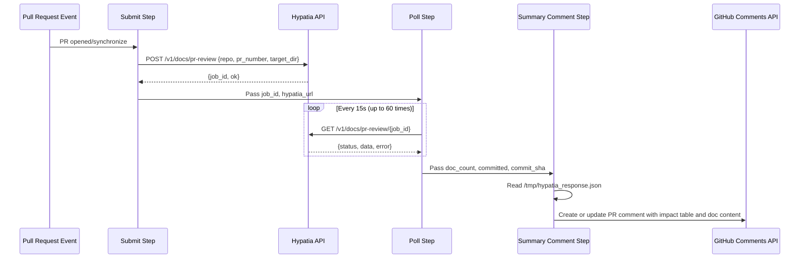
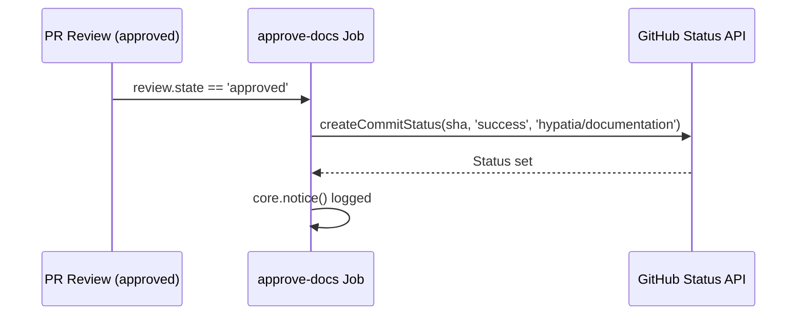
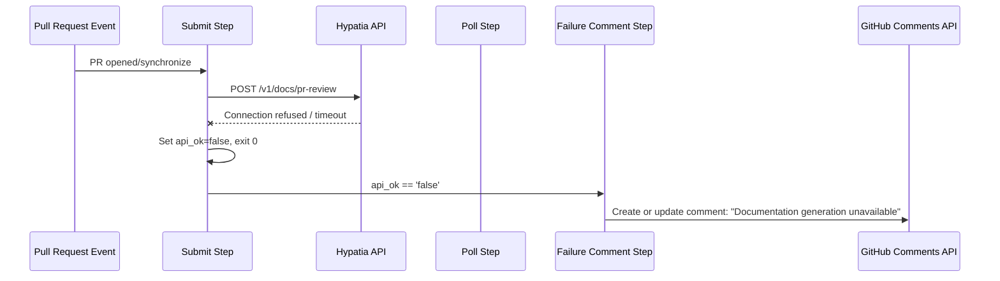

# Workflows — Design Reference

## Module Overview

This module defines a GitHub Actions workflow (`.github/workflows/doc-generation.yml`) that automates documentation generation for the `opa-psm2-tests` repository. When a pull request is opened or updated, the workflow submits a job to an external Hypatia API service, polls for completion, and posts the generated documentation content as a PR comment. It enforces a review gate via a `hypatia/documentation` commit status check: the status remains pending until a reviewer approves the PR, at which point a second job sets the status to success, unblocking merge. The workflow is designed to be portable across repositories.

## Component Diagram

```mermaid
component
    [GitHub PR Events] as Events
    [Concurrency Controller] as Concurrency
    [generate-docs Job] as GenJob
    [Submit Step] as Submit
    [Poll Step] as Poll
    [Summary Comment Step] as Summary
    [Failure Comment Step] as FailComment
    [approve-docs Job] as ApproveJob
    [Hypatia API] as HypatiaAPI
    [GitHub Commit Status API] as StatusAPI
    [GitHub Issues/Comments API] as CommentsAPI

    Events --> Concurrency
    Concurrency --> GenJob
    Concurrency --> ApproveJob
    GenJob --> Submit
    Submit --> HypatiaAPI
    Submit --> Poll
    Poll --> HypatiaAPI
    Poll --> Summary
    Poll --> FailComment
    Summary --> CommentsAPI
    FailComment --> CommentsAPI
    ApproveJob --> StatusAPI
```

## Key Flows

### 1. Documentation Generation on PR Open/Synchronize

This is the primary flow. When a pull request is opened or a new commit is pushed, the `generate-docs` job fires. It submits a POST request to the Hypatia API with the repository name, PR number, and target directory. It then polls the API every 15 seconds (up to 60 iterations / ~15 minutes) until the job completes or fails. On success, it reads the full response from a temporary file and posts a formatted PR comment containing an impact table and expandable sections with the full generated document content. If a prior bot comment exists, it is updated in place rather than creating a duplicate.



### 2. Documentation Approval on PR Review

When a reviewer approves the pull request, the `approve-docs` job runs. It reads the head SHA from the PR payload and sets the `hypatia/documentation` commit status to `success` via the GitHub Commit Status API. This unblocks any branch protection rules that require this status check to pass before merging.



### 3. Failure Handling and Degraded Operation

If the Hypatia API is unreachable during submission, or if the polling step times out or receives a non-success response, the workflow posts a failure comment on the PR. The submit step catches `curl` failures gracefully (setting `api_ok=false` and exiting 0 to avoid failing the entire workflow). The failure comment step detects this via conditional expressions on step outputs and posts a concise message indicating the service was unavailable, optionally including the error message from the API response.



## Data Model

The workflow does not maintain persistent state. All data flows through GitHub Actions step outputs and a temporary JSON file. The key data structures are:

| Structure | Location | Fields |
|---|---|---|
| Submit outputs | Step `submit` outputs | `hypatia_url`, `api_ok`, `job_id` |
| Poll outputs | Step `poll` outputs | `api_ok`, `doc_count`, `committed`, `commit_sha`, `error`, `done` |
| Hypatia response | `/tmp/hypatia_response.json` | `status`, `ok`, `error`, `data.generated_docs[]`, `data.impact_details[]`, `data.files_committed`, `data.commit_sha` |
| Generated doc entry | `data.generated_docs[]` | `path`, `content`, `content_preview`, `content_length`, `record_id` |
| Impact detail entry | `data.impact_details[]` | `source`, `status`, `additions`, `deletions`, `doc_type`, `target` |

## Dependencies

| Dependency | Purpose | Version |
|---|---|---|
| `actions/github-script` | Execute JavaScript for GitHub API calls (comments, statuses) | `v7` |
| `curl` | HTTP client for Hypatia API submission and polling | System (ubuntu-latest) |
| `jq` | JSON parsing of API responses in shell steps | System (ubuntu-latest) |
| Hypatia API (`hemingway.cn-agents.com`) | External service that analyzes PR diffs and generates documentation | `/v1/docs/pr-review` |
| GitHub REST API | Commit statuses, issue comments | Via `actions/github-script` |

## Configuration

| Parameter | Type | Required | Default | Description |
|---|---|---|---|---|
| `HYPATIA_API_URL` | Repository secret | No | `https://hemingway.cn-agents.com` | Base URL of the Hypatia documentation service |
| `target_dir` | Hardcoded in workflow | N/A | `"docs"` | Directory in the repo where generated docs are committed |
| `dry_run` | Hardcoded in workflow | N/A | `false` | Whether the API should skip committing files |
| Concurrency group | Workflow config | N/A | `doc-gen-{pr_number}` | Ensures only one doc generation runs per PR at a time |
| `timeout-minutes` | Workflow config | N/A | `20` (generate) / `5` (approve) | Maximum wall-clock time for each job |

The workflow requires three GitHub token permissions: `contents: write`, `pull-requests: write`, and `statuses: write`.

## Error Handling

The workflow employs a **graceful degradation** pattern throughout:

- **API unreachable on submit**: The `curl` command uses `-sf` (silent, fail on HTTP errors) with `--max-time 30` and `--retry 1`. On failure, the shell `||` block emits a GitHub Actions warning annotation, sets `api_ok=false`, and exits with code 0 — the workflow step succeeds but downstream steps are skipped via conditionals.
- **Polling failures**: Individual poll iterations use `curl -sf --max-time 10` with `|| continue`, so transient network errors during polling are silently retried on the next iteration.
- **Polling timeout**: If 60 iterations (15 minutes) elapse without a terminal status, a warning annotation is emitted and `api_ok` is set to `false`, triggering the failure comment path.
- **API returns failure status**: When the polled status is `"failed"`, the error message is extracted from the JSON response and propagated to the failure comment.
- **Comment idempotency**: Both the success and failure comment steps search for an existing bot comment by content markers (`'Documentation Generated'`, `'documentation impact'`, etc.) and update it in place rather than creating duplicates. Comments are fetched with `per_page: 100`.
- **Bot loop prevention**: The `generate-docs` job skips execution when the actor is `github-actions[bot]` or `scm-bot`, preventing infinite loops from bot-committed changes.

## Known Limitations / Technical Debt

1. **Hardcoded default URL**: The fallback Hypatia URL `https://hemingway.cn-agents.com` is hardcoded in the shell script (line 48). Note that the file header comment references a different default (`https://hypatia.cn-agents.com`), creating an inconsistency between documentation and implementation.

2. **Hardcoded `target_dir` and `dry_run`**: The values `"docs"` and `false` are embedded directly in the `curl` payload rather than being parameterized as workflow inputs, reducing reusability across repositories despite the header's stated intent ("Copy this workflow to any repo").

3. **Comment search limited to 100 comments**: The `per_page: 100` parameter on `listComments` means that on PRs with more than 100 comments, the bot may fail to find its prior comment and create a duplicate.

4. **No authentication to Hypatia API**: The `curl` calls to the external Hypatia service include no authentication headers (no API key, no bearer token). The service is called over HTTPS but access control relies entirely on network-level or server-side controls.

5. **Missing error handling on `createCommitStatus`**: The `approve-docs` job calls `github.rest.repos.createCommitStatus()` without a try/catch block. If the API call fails (e.g., invalid SHA, permissions issue), the step will throw an unhandled exception.

6. **Polling interval is not configurable**: The 15-second sleep and 60-iteration cap are hardcoded in the shell loop, making it difficult to tune for different API response times without editing the workflow file.

7. **Temporary file dependency**: The response JSON is written to `/tmp/hypatia_response.json` by the poll step and read by the summary step. This coupling between steps via the filesystem is fragile — if the poll step is skipped or fails before writing the file, the summary step's `fs.readFileSync` will throw an unhandled error (though the step condition should prevent this in practice).