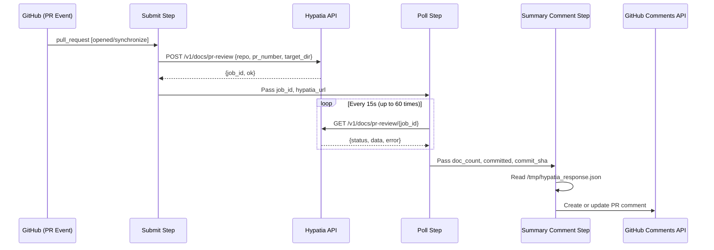
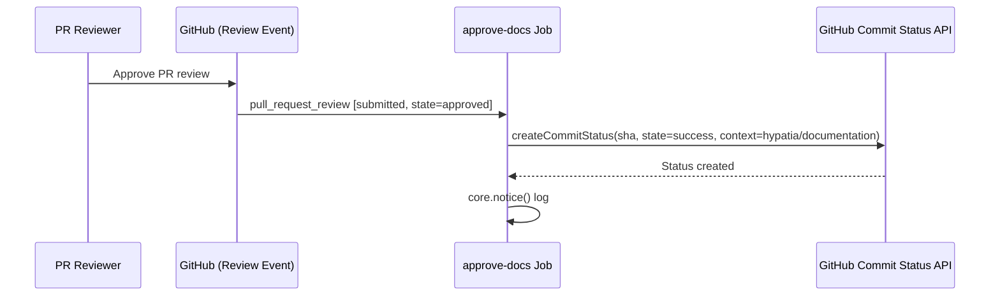
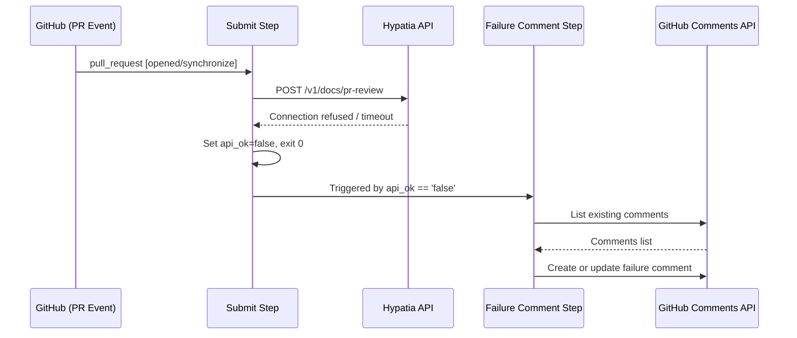

# Workflows — Design Reference

## Module Overview

This module defines a GitHub Actions workflow (`.github/workflows/doc-generation.yml`) that automates documentation generation for the `opa-psm2-tests` repository. When a pull request is opened or updated, the workflow submits a job to an external Hypatia API service, polls for completion, and posts the generated documentation content as a PR comment. It enforces a review gate via a `hypatia/documentation` commit status check: the status remains pending until a reviewer approves the PR, at which point a second job sets the status to success, unblocking merge. The workflow is designed to be portable across repositories.

## Component Diagram

```mermaid
component
    [GitHub PR Events] as Events
    [Concurrency Controller] as Concurrency
    [generate-docs Job] as GenJob
    [Submit Step] as Submit
    [Poll Step] as Poll
    [Summary Comment Step] as Summary
    [Failure Comment Step] as FailComment
    [approve-docs Job] as ApproveJob
    [Hypatia API] as HypatiaAPI
    [GitHub Commit Status API] as StatusAPI
    [GitHub Issues/Comments API] as CommentsAPI

    Events --> Concurrency
    Concurrency --> GenJob
    Concurrency --> ApproveJob
    GenJob --> Submit
    Submit --> HypatiaAPI
    Submit --> Poll
    Poll --> HypatiaAPI
    Poll --> Summary
    Poll --> FailComment
    Summary --> CommentsAPI
    FailComment --> CommentsAPI
    ApproveJob --> StatusAPI
```

## Key Flows

### 1. Documentation Generation on PR Open/Synchronize

This is the primary flow. When a pull request is opened or a new commit is pushed, the `generate-docs` job fires. It submits a POST request to the Hypatia API with the repository name, PR number, and target directory. It then polls the API every 15 seconds (up to 60 iterations / ~15 minutes) until the job reaches `completed` or `failed` status. On success, it reads the full response from a temporary file and posts a formatted PR comment containing an impact table and expandable sections with the full generated document content.



### 2. Documentation Approval on PR Review

When a reviewer approves the pull request, the `approve-docs` job runs. It reads the PR head SHA from the event payload and sets the `hypatia/documentation` commit status to `success` via the GitHub Commit Status API. This unblocks any branch protection rules that require this status check to pass before merging.



### 3. Failure Handling and Degraded Operation

If the Hypatia API is unreachable during submission, or if the polling step completes without a successful result, the workflow posts a failure comment on the PR. The submit step catches `curl` failures gracefully (setting `api_ok=false` and exiting 0 rather than failing the workflow). The failure comment step detects this via conditional expressions and posts a descriptive message. If a previous bot comment exists, it is updated in place rather than creating duplicates.



## Data Model

The workflow does not maintain persistent state. It operates on transient data passed between steps via GitHub Actions outputs and a temporary JSON file.

| Structure | Location | Description |
|---|---|---|
| Step outputs (`submit`) | `GITHUB_OUTPUT` | `hypatia_url`, `api_ok`, `job_id` — connection parameters and submission result |
| Step outputs (`poll`) | `GITHUB_OUTPUT` | `api_ok`, `doc_count`, `committed`, `commit_sha`, `error`, `done` — polling result fields |
| Hypatia response JSON | `/tmp/hypatia_response.json` | Full API response written by the poll step, read by the summary step. Contains `data.generated_docs[]` (each with `path`, `content`, `content_length`, `record_id`), `data.impact_details[]` (each with `source`, `status`, `additions`, `deletions`, `doc_type`, `target`), `data.files_committed`, and `data.commit_sha`. |
| PR comment body | GitHub Issues API | Markdown-formatted comment with impact table and expandable document sections. Identified by marker strings for idempotent updates. |

## Dependencies

| Dependency | Purpose | Version |
|---|---|---|
| GitHub Actions runner | Execution environment (`ubuntu-latest`) | Latest |
| `actions/github-script` | JavaScript-based GitHub API interaction for posting comments and setting commit statuses | v7 |
| `curl` | HTTP client for Hypatia API submission and polling | System-provided |
| `jq` | JSON parsing of Hypatia API responses | System-provided |
| Hypatia API (`/v1/docs/pr-review`) | External service that analyzes PR diffs and generates documentation | N/A (remote service) |
| GitHub REST API (Issues, Repos) | Comment management and commit status updates | v3 (via octokit) |

## Configuration

| Parameter | Type | Required | Default | Description |
|---|---|---|---|---|
| `HYPATIA_API_URL` | Repository secret | No | `https://hemingway.cn-agents.com` | Base URL of the Hypatia documentation service |
| `target_dir` | Hardcoded in workflow | N/A | `"docs"` | Directory in the repository where generated docs are committed |
| `dry_run` | Hardcoded in workflow | N/A | `false` | Whether the Hypatia API should skip committing files |
| Concurrency group | Workflow-level | N/A | `doc-gen-{pr_number}` | Ensures only one doc generation run per PR at a time; in-progress runs are cancelled |
| `timeout-minutes` | Job-level | N/A | 20 (generate-docs), 5 (approve-docs) | Maximum job execution time |

**Required GitHub permissions** (declared in the workflow):
- `contents: write` — allows committing generated docs to the PR branch
- `pull-requests: write` — allows posting and updating PR comments
- `statuses: write` — allows setting the `hypatia/documentation` commit status

## Error Handling

The workflow employs a **graceful degradation** pattern throughout:

- **API unreachable on submission**: The `curl` command uses `-sf` (silent, fail) with `--max-time 30` and `--retry 1`. If it fails, the shell `||` block emits a GitHub Actions warning annotation (`::warning::Hypatia API unreachable`), sets `api_ok=false`, and exits with code 0 — the workflow step succeeds but downstream steps detect the failure state.

- **Polling failures**: Individual poll iterations use `curl -sf` with `|| continue`, so transient network errors during polling are silently skipped. The loop continues until a terminal status is received or the 60-iteration limit (approximately 15 minutes) is reached.

- **Polling timeout**: If no terminal status is received within 60 iterations, a warning annotation is emitted and `api_ok` is set to `false`, triggering the failure comment path.

- **API returns failure status**: If the Hypatia job status is `failed`, the error message is extracted from the response JSON and propagated to the failure comment.

- **Idempotent comment management**: Both the success and failure comment steps search for an existing bot comment using marker strings (`'Documentation Generated'`, `'No documentation impact'`, `'Documentation generation'`). If found, the comment is updated rather than duplicated. This prevents comment spam on repeated pushes.

- **Bot loop prevention**: The `generate-docs` job has an `if` guard excluding `github-actions[bot]` and `scm-bot` actors, preventing infinite loops when the Hypatia service commits generated docs back to the PR branch.

## Known Limitations / Technical Debt

1. **Hardcoded default URL**: The fallback Hypatia URL (`https://hemingway.cn-agents.com`) is hardcoded in the shell script. Note that the file header comment references a different default (`https://hypatia.cn-agents.com`), creating a discrepancy between documentation and implementation.

2. **Hardcoded `target_dir` and `dry_run`**: The values `"docs"` and `false` are embedded directly in the `curl` payload rather than being parameterized as workflow inputs, reducing reusability across repositories despite the header's claim that the workflow can be copied to any repo.

3. **No authentication on Hypatia API calls**: Neither the submission nor polling `curl` calls include any authentication headers (e.g., bearer tokens). The API is called over HTTPS but relies entirely on the URL being secret for access control.

4. **Temporary file as inter-step data channel**: The full Hypatia response is written to `/tmp/hypatia_response.json` and read by a subsequent step. This works because both steps run on the same runner, but it is fragile — if the job structure changes to use separate runners or containers, this mechanism breaks silently.

5. **Comment marker string matching is brittle**: The logic to find existing bot comments relies on substring matching against multiple marker phrases. If the Hypatia API response content happens to contain these marker strings, false matches could occur.

6. **Missing error handling on `jq` parsing**: The `jq` commands in the submit and poll steps do not handle malformed JSON responses. If the API returns non-JSON content (e.g., an HTML error page), `jq` will fail and the step behavior becomes unpredictable.

7. **Polling interval is not configurable**: The 15-second sleep and 60-iteration cap are hardcoded, yielding a fixed ~15-minute maximum wait. There is no way to adjust this without editing the workflow file.

8. **`approve-docs` job does not verify documentation was generated**: The approval job unconditionally sets the commit status to `success` when any review approval occurs, regardless of whether the `generate-docs` job ran or produced output. A reviewer could approve before documentation generation completes.