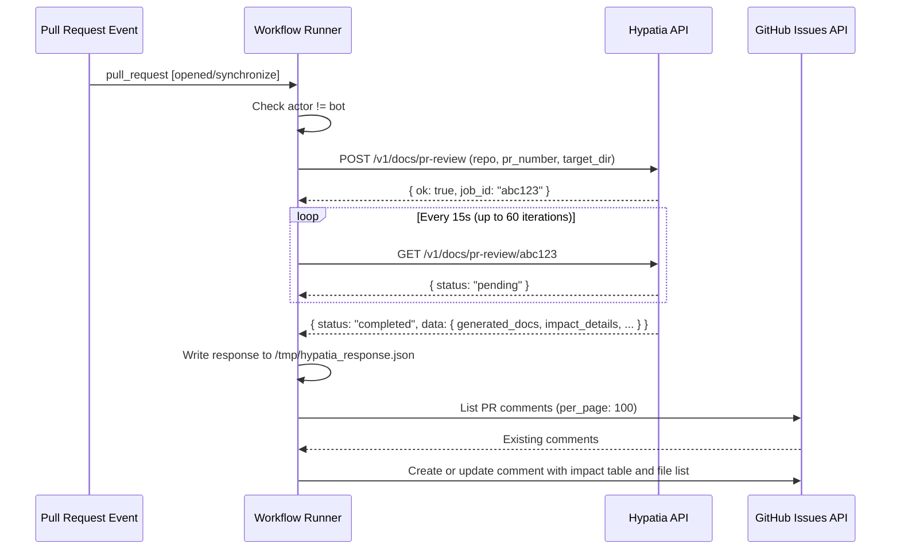
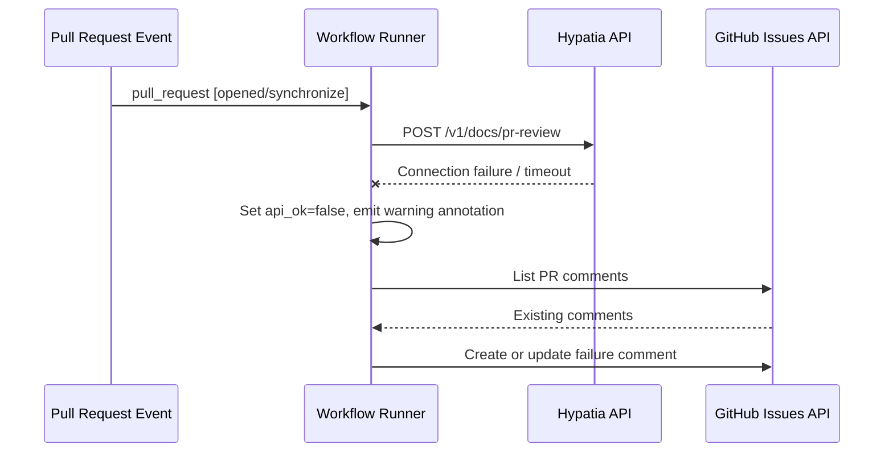
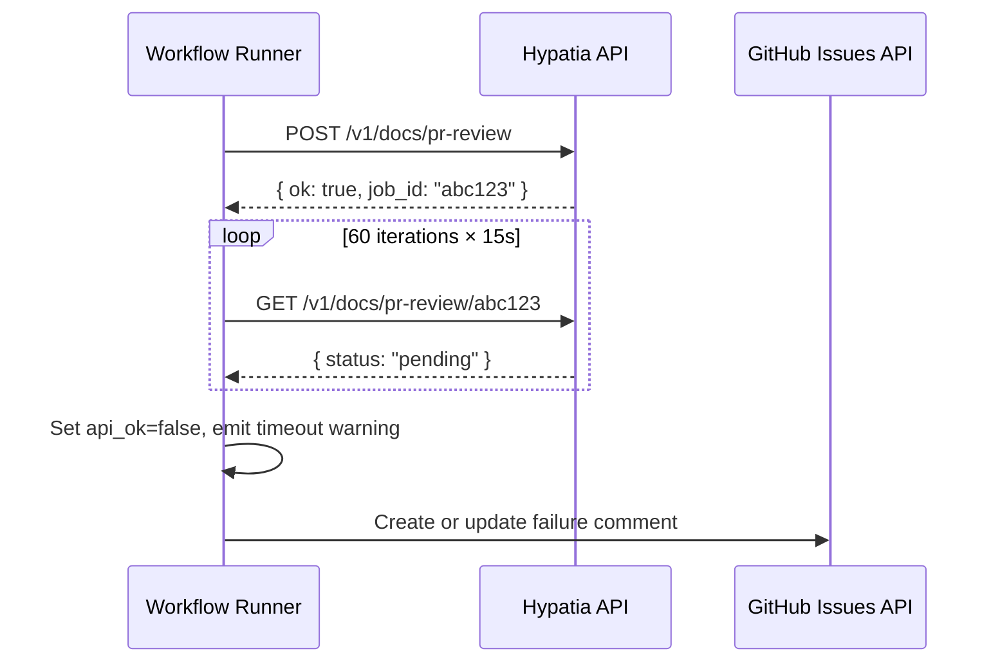

# Workflows — Design Reference

## Module Overview

This module contains a single GitHub Actions workflow (`doc-generation.yml`) that automates documentation generation for the `opa-psm2-tests` repository. When a pull request is opened or updated, the workflow submits a job to the Hypatia external API, polls for completion, and then posts a summary comment on the PR indicating what documentation was generated (or that no impact was detected). The workflow is designed to be reusable across repositories and includes concurrency controls, bot-actor guards, timeout handling, and idempotent PR comment management.

## Component Diagram

```mermaid
component
    [PR Event Trigger] as Trigger
    [Bot Guard] as Guard
    [Submit Step] as Submit
    [Hypatia API] as Hypatia
    [Poll Step] as Poll
    [Summary Comment Step] as Summary
    [Failure Comment Step] as Failure
    [GitHub Issues API] as GHAPI

    Trigger --> Guard
    Guard --> Submit
    Submit --> Hypatia : POST /v1/docs/pr-review
    Submit --> Poll
    Poll --> Hypatia : GET /v1/docs/pr-review/{job_id}
    Poll --> Summary : on success
    Poll --> Failure : on failure/timeout
    Submit --> Failure : on API unreachable
    Summary --> GHAPI : create/update comment
    Failure --> GHAPI : create/update comment
```

## Key Flows

### 1. Successful Documentation Generation

This is the primary happy-path flow. A PR event triggers the workflow, the Hypatia API accepts the job, polling detects completion, and a formatted summary comment is posted to the PR.



### 2. API Unreachable at Submission

When the Hypatia API is unreachable during the initial POST, the workflow gracefully degrades by setting 'api_ok=false', skipping the poll step, and posting a failure comment.



### 3. Polling Timeout

If the Hypatia job does not reach a terminal state ('completed' or 'failed') within 60 polling iterations (approximately 15 minutes), the workflow times out and posts a failure comment.



## Data Model

The workflow does not maintain persistent state. It operates on transient data passed between steps via GitHub Actions outputs and a temporary JSON file.

| Structure | Location | Description |
|---|---|---|
| Submit outputs | `steps.submit.outputs` | Contains 'hypatia_url', 'api_ok', and 'job_id' extracted from the initial API response. |
| Poll outputs | `steps.poll.outputs` | Contains 'api_ok', 'doc_count', 'committed', 'commit_sha', 'error', and 'done' extracted from the terminal poll response. |
| Hypatia response file | `/tmp/hypatia_response.json` | Full JSON response from the Hypatia API, written by the poll step and read by the summary comment step. Includes 'data.generated_docs' (array of `{path, content_length, record_id}`), 'data.impact_details' (array of `{source, status, additions, deletions, doc_type, target}`), 'data.impact_summary', 'data.files_committed', and 'data.commit_sha'. |
| PR comment body | GitHub Issues API | Markdown-formatted string containing an impact table and file list, or a no-impact/failure message. Comments are identified by marker strings for idempotent updates. |

## Dependencies

| Dependency | Purpose | Version |
|---|---|---|
| GitHub Actions runner | Workflow execution environment | `ubuntu-latest` |
| `actions/github-script` | Executes inline JavaScript for PR comment management via the GitHub API | `v7` |
| `curl` | HTTP client for Hypatia API calls (submit and poll) | System default |
| `jq` | JSON parsing of Hypatia API responses | System default |
| Hypatia API | External service that analyzes PR changes and generates documentation | `/v1/docs/pr-review` endpoint |

## Configuration

| Item | Type | Required | Default | Description |
|---|---|---|---|---|
| `HYPATIA_API_URL` | Repository secret | No | `https://hypatia.cn-agents.com` | Base URL of the Hypatia documentation generation service. |
| `target_dir` | Hardcoded in workflow | N/A | `"docs"` | Directory in the repository where generated documentation is committed. |
| `dry_run` | Hardcoded in workflow | N/A | `false` | Controls whether Hypatia commits files or only generates them. |
| `permissions.contents` | Workflow permission | Yes | `write` | Required for Hypatia to commit generated docs to the PR branch. |
| `permissions.pull-requests` | Workflow permission | Yes | `write` | Required for posting and updating PR comments. |

## Error Handling

The workflow employs a defensive, non-blocking error handling strategy throughout:

- **API unreachable on submit**: The 'curl' command uses '-sf' (silent, fail on HTTP errors) with '--max-time 30' and '--retry 1'. If the call fails, a '::warning' annotation is emitted, 'api_ok' is set to 'false', and the step exits with code 0 (success) to allow the failure comment step to run rather than failing the entire workflow.

- **Poll network errors**: Individual poll iterations use 'curl -sf --max-time 10' with stderr suppressed. If a single poll request fails, the loop simply 'continue's to the next iteration, providing resilience against transient network issues.

- **Poll timeout**: After 60 iterations (approximately 15 minutes of polling), the loop exits and sets 'api_ok=false'. A '::warning' annotation is emitted. The overall job also has a 'timeout-minutes: 15' guard.

- **Job failure from API**: If the Hypatia API returns 'status: "failed"', the poll step captures the 'error' field from the response and propagates it to the failure comment step.

- **Idempotent comments**: Both the summary and failure comment steps search existing PR comments (up to 100) for marker strings ('Documentation Generated', 'No documentation impact', 'Documentation analysis', 'Documentation generation'). If a matching comment from 'github-actions[bot]' is found, it is updated rather than duplicated.

- **Bot loop prevention**: The job-level 'if' condition excludes 'github-actions[bot]' and 'scm-bot' actors to prevent infinite trigger loops when the workflow commits documentation back to the PR branch.

- **Concurrency control**: The 'concurrency' group keyed on PR number with 'cancel-in-progress: true' ensures that rapid successive pushes cancel stale workflow runs.

## Known Limitations / Technical Debt

- **Hardcoded URL**: The default Hypatia API URL `https://hypatia.cn-agents.com` is hardcoded in the shell script. If the service moves, every repository using this workflow must either set the secret or update the workflow file.

- **Hardcoded `target_dir` and `dry_run`**: The values `"docs"` and `false` are embedded directly in the JSON payload with no mechanism for per-repository override without editing the workflow file.

- **Comment pagination limit**: The comment search uses 'per_page: 100' but does not paginate further. On PRs with more than 100 comments, the bot's earlier comment may not be found, resulting in duplicate comments.

- **Temporary file coupling**: The poll step writes to '/tmp/hypatia_response.json' and the summary comment step reads from the same path. This implicit coupling via the filesystem is fragile and would break if steps ran in different environments or containers.

- **No authentication on Hypatia API calls**: The 'curl' requests to the Hypatia API do not include any authentication headers (no API key, no bearer token). The API is called over HTTPS but access control relies entirely on the API server's own mechanisms.

- **Missing error handling on `jq` parsing**: If the Hypatia API returns malformed JSON, the 'jq' commands will fail silently (stderr is suppressed via '2>/dev/null' on the curl calls), potentially leaving step outputs empty or incorrect.

- **Poll interval is not configurable**: The 15-second sleep and 60-iteration maximum are hardcoded, yielding a fixed ~15-minute maximum wait that cannot be tuned without editing the workflow.