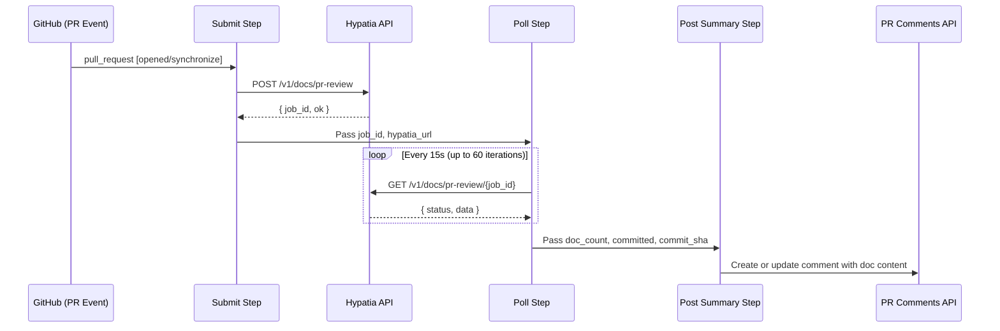
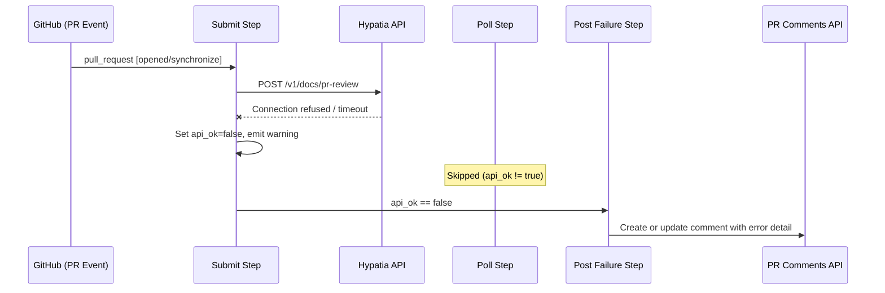
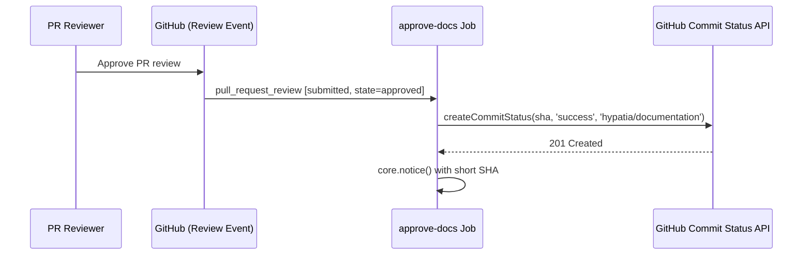

# Workflows — Design Reference

## Module Overview

This module defines a GitHub Actions workflow (`.github/workflows/doc-generation.yml`) that automates documentation generation for the `opa-psm2-tests` repository. The workflow integrates with an external service called **Hypatia** to analyze pull request changes, generate documentation artifacts, commit them to the PR branch, and gate merges behind a human review of the generated docs. It consists of two jobs: `generate-docs`, which handles the asynchronous submission, polling, and PR commenting lifecycle; and `approve-docs`, which transitions the `hypatia/documentation` commit status to `success` when a reviewer approves the PR.

## Component Diagram

```mermaid
component
    [PR Event Trigger] as Trigger
    [generate-docs Job] as GenJob
    [Submit Step] as Submit
    [Poll Step] as Poll
    [Post Summary Step] as Summary
    [Post Failure Step] as Failure
    [approve-docs Job] as ApproveJob
    [Hypatia API] as Hypatia
    [GitHub Commit Status API] as StatusAPI
    [GitHub PR Comments API] as CommentsAPI

    Trigger --> GenJob
    Trigger --> ApproveJob
    GenJob --> Submit
    Submit --> Hypatia
    Submit --> Poll
    Poll --> Hypatia
    Poll --> Summary
    Poll --> Failure
    Summary --> CommentsAPI
    Failure --> CommentsAPI
    ApproveJob --> StatusAPI
```

## Key Flows

### 1. Documentation Generation on PR Open/Update

When a pull request is opened or synchronized (new commits pushed), the `generate-docs` job submits a request to the Hypatia API, polls for completion, and posts the results as a PR comment.



**Description:** The submit step sends repository and PR metadata to Hypatia's `/v1/docs/pr-review` endpoint. If the API is reachable and returns a `job_id`, the poll step queries the job status every 15 seconds for up to 15 minutes. On completion, the full API response (including generated document content) is written to `/tmp/hypatia_response.json`. The summary step reads this file, formats an impact table and expandable document sections, and creates or updates a bot comment on the PR.

### 2. Failure Handling and Degraded Operation

When the Hypatia API is unreachable or the job fails, the workflow posts a failure comment and exits gracefully without blocking the PR.



**Description:** If the initial `curl` to Hypatia fails (network error, timeout, non-2xx response), the submit step sets `api_ok=false` and exits with code 0 — it does **not** fail the workflow run. The poll step is skipped entirely via its `if` condition. The failure comment step detects the `api_ok=false` output and posts a concise error message to the PR. Similarly, if polling completes but `api_ok` is not `true` (e.g., the job status was `failed` or the poll timed out after 15 minutes), the failure step activates.

### 3. Documentation Approval via PR Review

When a reviewer approves the PR, the `approve-docs` job sets the `hypatia/documentation` commit status to `success`, unblocking merge.



**Description:** This job runs exclusively on `pull_request_review` events where the review state is `approved`. It reads the PR head SHA from the event payload and sets the `hypatia/documentation` commit status context to `success` with a descriptive message. This is the mechanism that gates merge: the status remains pending (set server-side by Hypatia) until a human reviewer explicitly approves.

## Data Model

The workflow does not maintain persistent state. It operates on transient data structures passed between steps via GitHub Actions outputs and a temporary JSON file.

| Structure | Location | Description |
|---|---|---|
| **Submit outputs** | `steps.submit.outputs.*` | `hypatia_url`, `api_ok`, `job_id` — passed from the submit step to downstream steps. |
| **Poll outputs** | `steps.poll.outputs.*` | `api_ok`, `doc_count`, `committed`, `commit_sha`, `error`, `done` — extracted from the Hypatia job response. |
| **Hypatia response JSON** | `/tmp/hypatia_response.json` | Full API response written by the poll step and read by the summary step. Contains `data.generated_docs[]` (each with `path`, `content`, `content_length`, `record_id`), `data.impact_details[]` (each with `source`, `status`, `additions`, `deletions`, `doc_type`, `target`), `data.files_committed`, and `data.commit_sha`. |
| **PR comment body** | GitHub PR comments | Markdown-formatted string with impact table and expandable `<details>` blocks for each generated document. The bot identifies its own prior comments by searching for marker strings (`'Documentation Generated'`, `'No documentation impact'`, `'Documentation analysis'`). |

## Dependencies

| Dependency | Purpose | Version |
|---|---|---|
| GitHub Actions runner | Execution environment (`ubuntu-latest`) | Latest |
| `actions/github-script` | Inline JavaScript for GitHub API calls (comments, commit statuses) | `v7` |
| `curl` | HTTP client for Hypatia API submission and polling | System (ubuntu-latest) |
| `jq` | JSON parsing of Hypatia API responses in shell steps | System (ubuntu-latest) |
| Hypatia API (`/v1/docs/pr-review`) | External documentation generation service | N/A (service) |
| GitHub REST API (Issues, Repos) | PR comment management and commit status updates | v3 (via octokit) |

## Configuration

| Item | Type | Required | Default | Description |
|---|---|---|---|---|
| `HYPATIA_API_URL` | Repository secret | No | `https://hemingway.cn-agents.com` | Base URL of the Hypatia documentation service. The workflow header comment references `https://hypatia.cn-agents.com` but the code defaults to `https://hemingway.cn-agents.com`. |
| `target_dir` | Hardcoded in workflow | N/A | `"docs"` | Directory in the repository where generated documentation is committed by Hypatia. |
| `dry_run` | Hardcoded in workflow | N/A | `false` | Controls whether Hypatia actually commits files or only generates them. |
| `concurrency.group` | Workflow setting | N/A | `doc-gen-{pr_number}` | Ensures only one documentation generation run per PR; in-progress runs are cancelled. |
| `timeout-minutes` | Job setting | N/A | `20` (generate-docs), `5` (approve-docs) | Maximum wall-clock time for each job. |

## Error Handling

The workflow employs a **graceful degradation** pattern — failures in the documentation generation path never block the PR or fail the workflow run.

- **API unreachable:** The `curl` command in the submit step uses `-sf` (silent, fail on HTTP errors) with `--max-time 30` and `--retry 1`. On failure, the shell `|| { ... }` block emits a GitHub Actions `::warning::` annotation, sets `api_ok=false`, and exits with code 0.
- **Poll network errors:** Individual poll iterations use `curl -sf --max-time 10 ... || continue`, silently skipping transient failures and retrying on the next 15-second cycle.
- **Poll timeout:** If 60 iterations (15 minutes) elapse without a terminal status (`completed` or `failed`), the poll step emits a `::warning::` and sets `api_ok=false`.
- **Job failure status:** If Hypatia returns `status: "failed"`, the poll step captures the `error` field from the response and passes it to the failure comment step.
- **Comment idempotency:** Both the summary and failure comment steps search for an existing bot comment by marker strings before deciding whether to create or update, preventing duplicate comments on re-runs.
- **Actor guard:** The `generate-docs` job skips execution when the actor is `github-actions[bot]` or `scm-bot`, preventing infinite loops from bot-committed documentation changes triggering new workflow runs.

## Known Limitations / Technical Debt

1. **Hardcoded URL mismatch:** The file header comment states the default is `https://hypatia.cn-agents.com`, but the actual shell code defaults to `https://hemingway.cn-agents.com`. This discrepancy could confuse operators configuring the secret.

2. **Hardcoded `target_dir` and `dry_run`:** The values `"docs"` and `false` are embedded directly in the workflow YAML. Repositories with different documentation directory conventions would need to fork and modify the workflow rather than configure it via inputs or secrets.

3. **No authentication on Hypatia API calls:** The `curl` requests to the Hypatia API do not include any authentication token or API key header. The service is called over HTTPS but access control relies entirely on network-level or server-side mechanisms.

4. **Temporary file coupling between steps:** The poll step writes to `/tmp/hypatia_response.json` and the summary step reads from the same path. This works because both steps run in the same job on the same runner, but it is fragile — any refactoring that splits these into separate jobs would break the data handoff.

5. **Comment marker string fragility:** The bot comment deduplication logic relies on searching for specific English-language substrings (`'Documentation Generated'`, `'No documentation impact'`, `'Documentation analysis'`). If the comment format changes, stale comments may accumulate.

6. **Missing status-pending step:** The workflow header describes setting `hypatia/documentation` status to `pending`, but the workflow itself never creates a pending status. This is presumably done server-side by Hypatia, but if Hypatia is unreachable, no status check is created at all — meaning the merge gate is silently absent rather than blocking.

7. **Poll step `jq` expression edge case:** The expression `.data.generated_docs | length // 0` will produce a `jq` error if `data` or `generated_docs` is `null` rather than an absent key, because `length` of `null` is `0` in `jq` but the `//` alternative operator may not behave as expected in all `jq` versions.