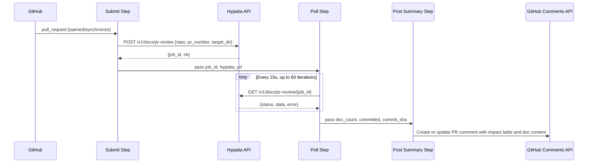
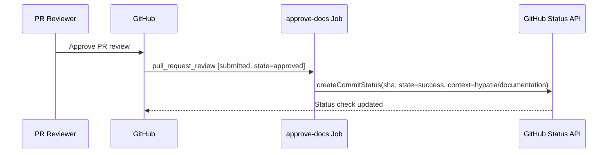
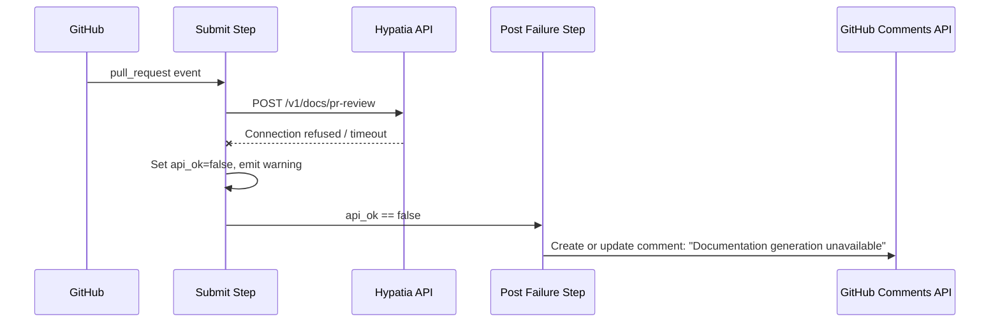

# Workflows — Design Reference

## Module Overview

This module defines a GitHub Actions workflow (`doc-generation.yml`) that automates documentation generation for the `opa-psm2-tests` repository. The workflow integrates with an external service called **Hypatia** to analyze pull request changes, generate documentation artifacts, commit them to the PR branch, and gate merges behind a human review of the generated docs. It consists of two jobs: `generate-docs`, which handles the submit-poll-report lifecycle on PR open/update events, and `approve-docs`, which transitions a commit status check to success when a reviewer approves the PR.

## Component Diagram

```mermaid
componentDiagram
  component "GitHub PR Events" as PREvents
  component "generate-docs Job" as GenJob {
    component "Submit Step" as Submit
    component "Poll Step" as Poll
    component "Post Summary Step" as PostSummary
    component "Post Failure Step" as PostFailure
  }
  component "approve-docs Job" as ApproveJob
  component "Hypatia API" as HypatiaAPI
  component "GitHub Commit Status API" as StatusAPI
  component "GitHub PR Comments API" as CommentsAPI

  PREvents --> GenJob : "pull_request [opened, synchronize]"
  PREvents --> ApproveJob : "pull_request_review [approved]"
  Submit --> HypatiaAPI : "POST /v1/docs/pr-review"
  Poll --> HypatiaAPI : "GET /v1/docs/pr-review/{job_id}"
  PostSummary --> CommentsAPI : "create/update comment"
  PostFailure --> CommentsAPI : "create/update comment"
  ApproveJob --> StatusAPI : "set hypatia/documentation = success"
```

## Key Flows

### 1. Documentation Generation on PR Open/Update

When a pull request is opened or synchronized (new commits pushed), the `generate-docs` job submits a request to the Hypatia API, polls for completion, and posts results as a PR comment.



The submit step sends repository and PR metadata to Hypatia's `/v1/docs/pr-review` endpoint. If the API is unreachable, the workflow emits a warning and exits gracefully. On success, the poll step queries the job status every 15 seconds for up to 15 minutes. Once completed, the response JSON (written to `/tmp/hypatia_response.json`) is parsed by the summary step, which formats an impact table and expandable document sections into a PR comment. The comment is idempotent — it updates an existing bot comment if one is found.

### 2. Documentation Approval via PR Review

When a reviewer approves the PR, the `approve-docs` job transitions the `hypatia/documentation` commit status to `success`, unblocking merge.



This job is intentionally minimal. It reads the PR head SHA from the event payload and sets the `hypatia/documentation` context to `success` with a descriptive message. The job has a 5-minute timeout and requires no external service beyond the GitHub API.

### 3. Failure Handling and Degraded Operation

When the Hypatia API is unreachable or the job fails, the workflow posts a failure comment to the PR rather than failing the entire workflow run.



The failure step activates when either the submit step sets `api_ok=false` (API unreachable) or the poll step completes without a successful result. The error message from the API response, if available, is included in the comment. Like the success path, the comment is idempotent.

## Data Model

The workflow does not maintain persistent state. All data flows through GitHub Actions step outputs and a temporary JSON file.

| Structure | Location | Description |
|---|---|---|
| Submit outputs | `steps.submit.outputs` | Contains `hypatia_url`, `api_ok`, `job_id` |
| Poll outputs | `steps.poll.outputs` | Contains `api_ok`, `doc_count`, `committed`, `commit_sha`, `error`, `done` |
| Hypatia response JSON | `/tmp/hypatia_response.json` | Full API response written by the poll step, read by the summary step. Contains `data.generated_docs[]` (each with `path`, `content`, `content_length`, `record_id`), `data.impact_details[]` (each with `source`, `status`, `additions`, `deletions`, `doc_type`, `target`), `data.files_committed`, and `data.commit_sha`. |
| PR comment body | GitHub PR comments | Markdown-formatted string with impact table and collapsible doc sections. Identified for idempotent updates by marker strings: `'Documentation Generated'`, `'No documentation impact'`, `'Documentation analysis'`. |

## Dependencies

| Dependency | Purpose | Version |
|---|---|---|
| GitHub Actions runner | Execution environment (`ubuntu-latest`) | Latest |
| `actions/github-script` | JavaScript-based GitHub API interaction for comments and statuses | `v7` |
| `curl` | HTTP client for Hypatia API calls (submit and poll steps) | System default |
| `jq` | JSON parsing of Hypatia API responses | System default |
| Hypatia API | External documentation generation service | `/v1/docs/pr-review` endpoint |
| GitHub REST API | Commit statuses, issue comments | Via `actions/github-script` Octokit |

## Configuration

| Item | Type | Required | Default | Description |
|---|---|---|---|---|
| `HYPATIA_API_URL` | Repository secret | No | `https://hemingway.cn-agents.com` | Base URL of the Hypatia documentation service. |
| `target_dir` | Hardcoded in workflow | N/A | `"docs"` | Directory in the repository where generated docs are committed by Hypatia. |
| `dry_run` | Hardcoded in workflow | N/A | `false` | Controls whether Hypatia actually commits files. |
| Concurrency group | Workflow config | N/A | `doc-gen-{pr_number}` | Ensures only one doc generation run per PR; in-progress runs are cancelled. |
| `timeout-minutes` | Workflow config | N/A | 20 (generate-docs), 5 (approve-docs) | Job-level timeouts. |
| Actor exclusions | Job condition | N/A | `github-actions[bot]`, `scm-bot` | Prevents infinite loops from bot-authored commits triggering the workflow. |

## Error Handling

The workflow employs a **graceful degradation** pattern throughout:

- **API unreachable on submit**: The `curl` command uses `-sf` (silent, fail on HTTP errors) with `--max-time 30` and `--retry 1`. If the request fails, a `::warning` annotation is emitted, `api_ok` is set to `false`, and the step exits with code 0 (success) to avoid failing the workflow run.
- **Poll failures**: Individual poll iterations use `|| continue` to silently skip transient network errors. If all 60 iterations (15 minutes) elapse without a terminal status, a warning is emitted and `api_ok` is set to `false`.
- **API returns failure status**: When the polled job status is `"failed"`, the error message is extracted from the response and propagated to the failure comment step.
- **Comment idempotency**: Both the success and failure comment steps search for an existing bot comment by marker strings before deciding whether to create or update. This prevents duplicate comments on repeated `synchronize` events.
- **No exception hierarchy**: Since the workflow is shell scripts and inline JavaScript, errors are handled via exit codes, conditional step execution (`if:` guards), and output variable checks rather than structured exceptions.

## Known Limitations / Technical Debt

- **Hardcoded URL in default fallback**: The default Hypatia URL (`https://hemingway.cn-agents.com`) is hardcoded in the shell script rather than being defined as a workflow-level environment variable. The file header comment references a different default (`https://hypatia.cn-agents.com`), creating a discrepancy between documentation and implementation.
- **Hardcoded `target_dir` and `dry_run`**: The values `"docs"` and `false` are embedded in the curl payload with no mechanism to override them per-repository without forking the workflow file.
- **Polling is fixed-interval with no backoff**: The poll loop sleeps a constant 15 seconds between attempts. There is no exponential backoff or jitter, which could be problematic under load.
- **Temporary file coupling**: The submit/poll steps communicate with the summary step via `/tmp/hypatia_response.json`. This is fragile — if the runner environment changes or steps run in different containers, the file may not be accessible.
- **Comment marker string fragility**: The idempotent comment update logic relies on searching for specific English-language substrings (`'Documentation Generated'`, `'No documentation impact'`, etc.) in comment bodies. If the message format changes, stale comments may accumulate.
- **No authentication to Hypatia API**: The `curl` calls include no authentication headers (no API key, no bearer token). The API is called over HTTPS but access control relies entirely on network-level or server-side restrictions.
- **Missing error handling on `jq` parsing**: If the Hypatia API returns malformed JSON or unexpected schema, `jq` expressions use `// empty` or `// false` fallbacks, but there is no validation that critical fields like `job_id` are well-formed before using them in subsequent URL construction.
- **100-comment pagination limit**: The comment search uses `per_page: 100` with no pagination. On PRs with more than 100 comments, the bot's existing comment may not be found, resulting in a duplicate.