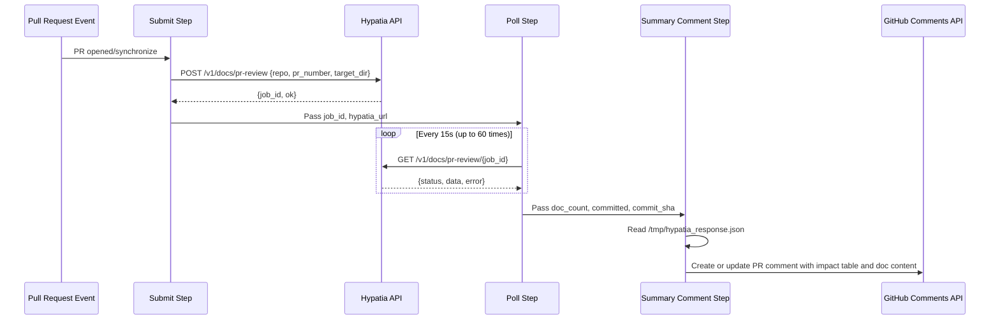
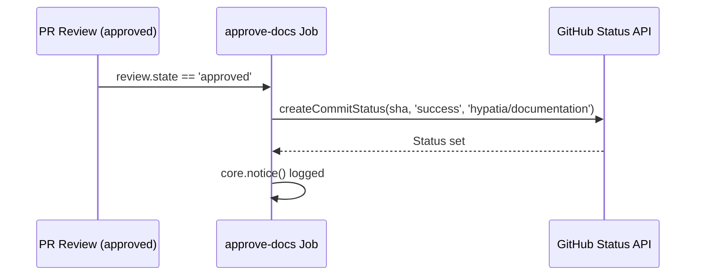
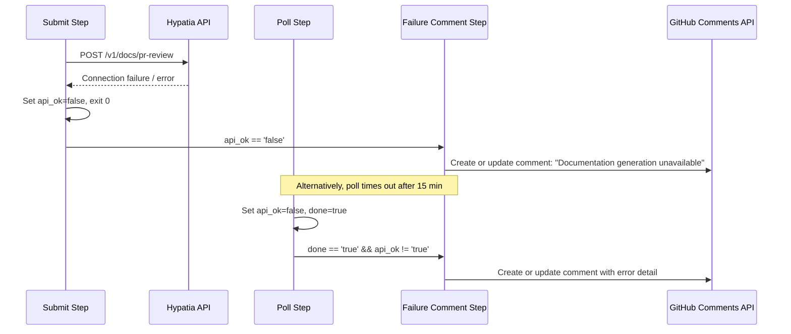

# Workflows — Design Reference

## Module Overview

This module defines a GitHub Actions workflow (`.github/workflows/doc-generation.yml`) that automates documentation generation for the `opa-psm2-tests` repository. When a pull request is opened or updated, the workflow submits a job to an external Hypatia API service, polls for completion, and posts the generated documentation content as a PR comment. It enforces a review gate via a `hypatia/documentation` commit status check: the status remains pending until a reviewer approves the PR, at which point a second job sets the status to success, unblocking merge. The workflow is designed to be portable across repositories.

## Component Diagram

```mermaid
component
    [GitHub PR Events] as Events
    [Concurrency Controller] as Concurrency
    [generate-docs Job] as GenJob
    [Submit Step] as Submit
    [Poll Step] as Poll
    [Summary Comment Step] as Summary
    [Failure Comment Step] as FailComment
    [approve-docs Job] as ApproveJob
    [Hypatia API] as HypatiaAPI
    [GitHub Commit Status API] as StatusAPI
    [GitHub Issues/Comments API] as CommentsAPI

    Events --> Concurrency
    Concurrency --> GenJob
    Concurrency --> ApproveJob
    GenJob --> Submit
    Submit --> HypatiaAPI
    Submit --> Poll
    Poll --> HypatiaAPI
    Poll --> Summary
    Poll --> FailComment
    Summary --> CommentsAPI
    FailComment --> CommentsAPI
    ApproveJob --> StatusAPI
```

## Key Flows

### 1. Documentation Generation on PR Open/Synchronize

This is the primary flow. When a pull request is opened or a new commit is pushed, the `generate-docs` job fires. It submits a POST request to the Hypatia API with the repository name, PR number, and target directory. It then polls the API every 15 seconds (up to 60 iterations / ~15 minutes) until the job completes or fails. On success, it reads the full response from a temporary file and posts a formatted PR comment containing an impact table and expandable sections with the full generated document content. If a prior bot comment exists, it is updated in place rather than creating a duplicate.



### 2. Documentation Approval on PR Review

When a reviewer approves the pull request, the `approve-docs` job runs. It reads the PR head SHA from the event payload and sets the `hypatia/documentation` commit status to `success` via the GitHub Commit Status API. This unblocks any branch protection rules that require this status check to pass before merging.



### 3. Failure Handling When API Is Unreachable or Job Fails

If the Hypatia API is unreachable during submission, or if the polling step completes without a successful result (timeout or API error), the workflow posts a failure comment on the PR. The comment includes the error message from the API response if available, or a generic "API did not respond" message. Like the success comment, it uses idempotent comment management — finding and updating any existing bot comment rather than creating duplicates.



## Data Model

The workflow does not maintain persistent state. All data flows through GitHub Actions step outputs and a temporary JSON file. The key data structures are:

| Structure | Location | Fields |
|-----------|----------|--------|
| Submit outputs | `steps.submit.outputs` | `hypatia_url`, `api_ok`, `job_id` |
| Poll outputs | `steps.poll.outputs` | `api_ok`, `doc_count`, `committed`, `commit_sha`, `error`, `done` |
| Hypatia response | `/tmp/hypatia_response.json` | `status`, `ok`, `error`, `data.generated_docs[]`, `data.impact_details[]`, `data.files_committed`, `data.commit_sha` |
| Generated doc entry | `data.generated_docs[]` | `path`, `content`, `content_preview`, `content_length`, `record_id` |
| Impact detail entry | `data.impact_details[]` | `source`, `status`, `additions`, `deletions`, `doc_type`, `target` |

## Dependencies

| Dependency | Purpose | Version |
|------------|---------|---------|
| `actions/github-script` | Execute JavaScript for GitHub API calls (comments, statuses) | `v7` |
| `curl` | HTTP client for Hypatia API submission and polling | System (ubuntu-latest) |
| `jq` | JSON parsing of API responses in shell steps | System (ubuntu-latest) |
| Hypatia API (`hemingway.cn-agents.com`) | External service that analyzes PR diffs and generates documentation | `/v1/docs/pr-review` endpoint |
| GitHub REST API | Commit statuses, issue comments | Via `actions/github-script` Octokit |

## Configuration

| Item | Type | Required | Default | Description |
|------|------|----------|---------|-------------|
| `HYPATIA_API_URL` | Repository secret | No | `https://hemingway.cn-agents.com` | Base URL of the Hypatia documentation service |
| `target_dir` | Hardcoded in workflow | N/A | `"docs"` | Directory in the repo where generated docs are committed |
| `dry_run` | Hardcoded in workflow | N/A | `false` | Whether the API should skip committing files |
| Concurrency group | Workflow config | N/A | `doc-gen-{pr_number}` | Ensures only one doc generation run per PR at a time |
| `timeout-minutes` | Workflow config | N/A | `20` (generate-docs), `5` (approve-docs) | Job-level timeout |
| Actor exclusions | Job condition | N/A | `github-actions[bot]`, `scm-bot` | Prevents infinite loops from bot-authored commits |

## Error Handling

The workflow employs a **graceful degradation** pattern throughout:

- **API unreachable on submit**: The `curl` command uses `-sf` (silent, fail on HTTP errors) with `--max-time 30` and `--retry 1`. If the request fails, a `::warning` annotation is emitted, `api_ok` is set to `false`, and the step exits with code 0 (non-fatal). The failure comment step then activates.
- **Poll network errors**: Individual poll iterations use `|| continue`, so transient network failures during polling do not abort the loop — the next iteration retries.
- **Poll timeout**: If 60 iterations (15 minutes) elapse without a terminal status, the workflow emits a `::warning` and sets `api_ok=false`, triggering the failure comment path.
- **Idempotent comments**: Both success and failure comment steps search for an existing bot comment by matching known marker strings (`'Documentation Generated'`, `'documentation impact'`, `'Documentation analysis'`, `'Documentation generation'`). If found, the comment is updated; otherwise a new one is created. This prevents comment spam on repeated pushes.
- **Job-level conditions**: The `generate-docs` job skips entirely for bot actors to prevent infinite trigger loops when the Hypatia service commits generated docs back to the PR branch.

There is no formal exception hierarchy; error handling is conditional step execution driven by output variables (`api_ok`, `done`).

## Known Limitations / Technical Debt

- **Hardcoded default URL**: The fallback Hypatia URL `https://hemingway.cn-agents.com` is hardcoded in the shell script (line 48). Note that the file header comment references a different default (`https://hypatia.cn-agents.com`), creating a discrepancy between documentation and implementation.
- **Hardcoded `target_dir` and `dry_run`**: The values `"docs"` and `false` are embedded in the curl payload with no mechanism to override them per-repository without editing the workflow file.
- **No authentication on API calls**: The Hypatia API requests include no authentication token or API key. The service is called over HTTPS but access control relies entirely on network-level or server-side restrictions.
- **Polling ceiling of 15 minutes**: The 60-iteration × 15-second polling loop caps at 15 minutes. For large repositories, this may be insufficient. The timeout is not configurable.
- **Temporary file coupling**: The summary comment step reads `/tmp/hypatia_response.json` written by the poll step. This couples the two steps via a filesystem side-channel rather than step outputs, which could be fragile if runner behavior changes.
- **Comment marker string fragility**: The idempotent comment logic relies on substring matching against multiple hardcoded marker strings. If the comment format changes, stale comments may accumulate instead of being updated.
- **Missing status check creation on generation**: The workflow header describes setting `hypatia/documentation` status to pending during generation, but the `generate-docs` job never actually creates a pending commit status. Only the `approve-docs` job interacts with the status API (setting it to success). The pending state must be set server-side by the Hypatia API, which is an implicit external dependency.
- **`per_page: 100` comment listing**: The comment search fetches only the first 100 comments. On PRs with extensive discussion, the bot comment could fall outside this window and a duplicate would be created.