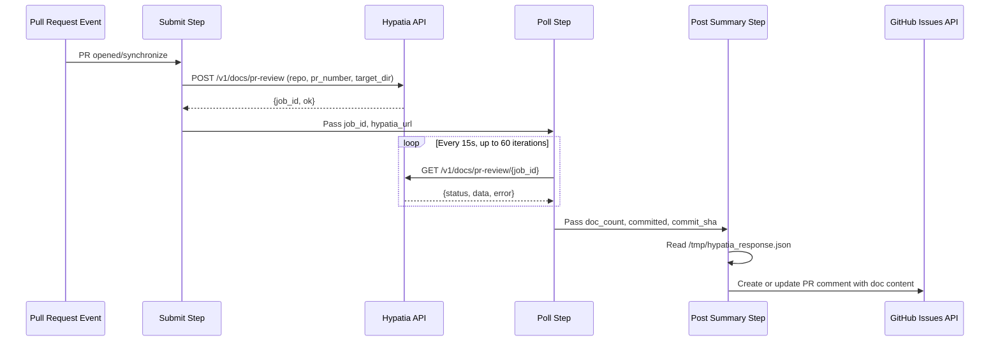
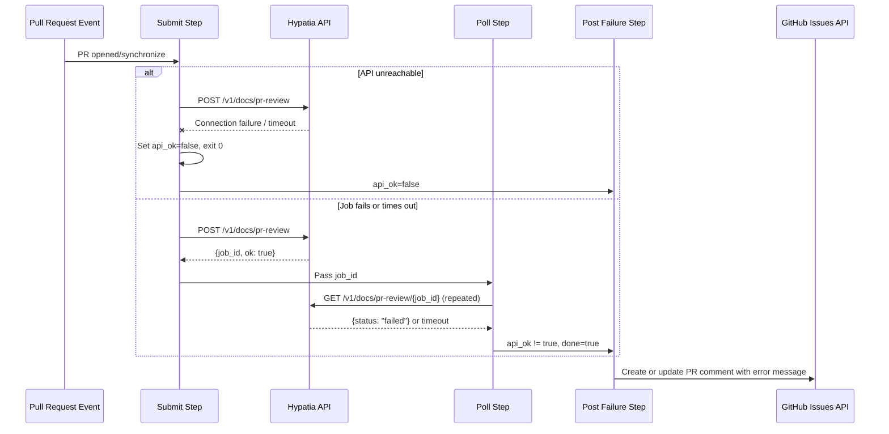
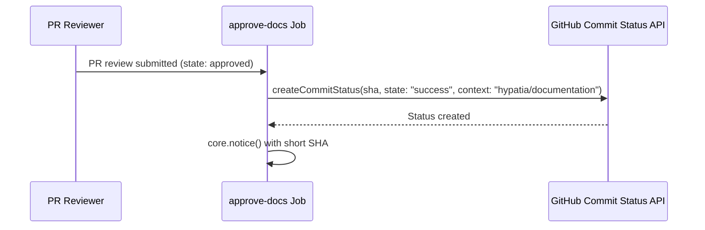

# Workflows — Design Reference

## Module Overview

This module consists of a single GitHub Actions workflow definition (`.github/workflows/doc-generation.yml`) that integrates the Hypatia documentation generation service into the pull request lifecycle of the `opa-psm2-tests` repository. The workflow reacts to PR open/update events by submitting an asynchronous job to an external Hypatia API, polling for completion, and posting the resulting documentation as a PR comment. It enforces a human-in-the-loop review gate via a `hypatia/documentation` commit status check: documentation remains in a "pending" state until a reviewer approves the PR, at which point a second job marks the status as "success" to unblock merge.

## Component Diagram

```mermaid
component
    [GitHub PR Events] as Events
    [Concurrency Controller] as Concurrency
    [generate-docs Job] as GenJob
    [Submit Step] as Submit
    [Poll Step] as Poll
    [Post Summary Step] as PostSummary
    [Post Failure Step] as PostFailure
    [approve-docs Job] as ApproveJob
    [Hypatia API] as HypatiaAPI
    [GitHub API] as GitHubAPI

    Events --> Concurrency
    Concurrency --> GenJob
    Concurrency --> ApproveJob
    GenJob --> Submit
    Submit --> HypatiaAPI
    Submit --> Poll
    Poll --> HypatiaAPI
    Poll --> PostSummary
    Poll --> PostFailure
    PostSummary --> GitHubAPI
    PostFailure --> GitHubAPI
    ApproveJob --> GitHubAPI
```

## Key Flows

### 1. Documentation Generation on PR Open/Synchronize

This is the primary flow. When a pull request is opened or updated (and the actor is not a bot), the `generate-docs` job submits a documentation generation request to the Hypatia API, polls until the job completes or times out, and then posts the results as a PR comment.



**Details:** The submit step resolves the Hypatia URL from the `HYPATIA_API_URL` secret (falling back to `https://hypatia.cn-agents.com`), sends a POST with repository and PR metadata, and extracts the `job_id`. The poll step then queries the job status endpoint every 15 seconds for up to 15 minutes. On completion, the full API response is written to `/tmp/hypatia_response.json` for consumption by the summary step, which formats an impact table and expandable document sections into a Markdown PR comment. The comment is idempotent — it updates an existing bot comment if one is found.

### 2. Documentation Generation Failure Handling

When the Hypatia API is unreachable during submission, or the polling step completes without a successful result, the workflow posts a failure comment on the PR.



**Details:** The failure step's conditional guard fires when either `submit.outputs.api_ok` is `'false'` or when polling completed but `api_ok` is not `'true'`. The error message from the API response (if available) is included in the comment. Like the success path, the comment is idempotent.

### 3. Documentation Approval on PR Review

When a reviewer approves the pull request, the `approve-docs` job sets the `hypatia/documentation` commit status to `success`, unblocking any branch protection rules that require this check to pass before merge.



**Details:** This job is gated on `github.event.review.state == 'approved'` and runs independently of the `generate-docs` job. It uses the PR head SHA from the event payload. The commit status context `hypatia/documentation` is expected to be configured as a required status check in branch protection rules.

## Data Model

The workflow does not maintain persistent state. All data flows through GitHub Actions step outputs and a temporary JSON file. The key data structures are:

| Structure | Location | Fields |
|-----------|----------|--------|
| Submit outputs | `steps.submit.outputs` | `hypatia_url`, `api_ok`, `job_id` |
| Poll outputs | `steps.poll.outputs` | `api_ok`, `doc_count`, `committed`, `commit_sha`, `error`, `done` |
| Hypatia response | `/tmp/hypatia_response.json` | `status`, `ok`, `error`, `data.generated_docs[]`, `data.impact_details[]`, `data.files_committed`, `data.commit_sha` |
| Generated doc entry | `data.generated_docs[]` | `path`, `content`, `content_preview`, `content_length`, `record_id` |
| Impact detail entry | `data.impact_details[]` | `source`, `status`, `additions`, `deletions`, `doc_type`, `target` |

## Dependencies

| Dependency | Purpose | Version |
|------------|---------|---------|
| GitHub Actions runner | Workflow execution environment | `ubuntu-latest` |
| `actions/github-script` | Inline JavaScript for GitHub API calls (comments, commit statuses) | `v7` |
| `curl` | HTTP client for Hypatia API submission and polling | System default |
| `jq` | JSON parsing of Hypatia API responses | System default |
| Hypatia API (`/v1/docs/pr-review`) | External service that analyzes PR diffs and generates documentation | N/A (remote service) |
| GitHub REST API | PR comments (`issues.listComments`, `createComment`, `updateComment`) and commit statuses (`repos.createCommitStatus`) | v3 (via octokit in `actions/github-script`) |

## Configuration

| Item | Type | Required | Default | Description |
|------|------|----------|---------|-------------|
| `HYPATIA_API_URL` | Repository secret | No | `https://hypatia.cn-agents.com` | Base URL of the Hypatia documentation generation service |
| `target_dir` | Hardcoded in workflow | N/A | `"docs"` | Directory in the repository where generated docs are committed |
| `dry_run` | Hardcoded in workflow | N/A | `false` | Whether the Hypatia job should skip committing files |
| Concurrency group | Workflow-level | N/A | `doc-gen-{pr_number}` | Ensures only one doc generation run per PR at a time; in-progress runs are cancelled |
| Permissions | Workflow-level | N/A | `contents: write`, `pull-requests: write`, `statuses: write` | Required GitHub token scopes |
| Bot actor exclusions | Job conditional | N/A | `github-actions[bot]`, `scm-bot` | Prevents infinite loops from bot-authored commits |

## Error Handling

The workflow employs a **graceful degradation** pattern throughout:

- **API unreachable on submit:** The `curl` command uses `-sf` (silent, fail on HTTP errors) with `--max-time 30` and `--retry 1`. If the request fails, a `::warning` annotation is emitted, `api_ok` is set to `'false'`, and the step exits with code 0 (non-failing). This ensures the workflow does not block the PR.

- **Polling failures:** Individual poll iterations use `curl -sf --max-time 10` with `|| continue`, so transient network errors during polling are silently skipped and the next iteration retries. If all 60 iterations (15 minutes total) elapse without a terminal status, a `::warning` is emitted and `api_ok` is set to `'false'`.

- **API returns failure status:** When the Hypatia job status is `"failed"`, the response is still captured and the error message is extracted from the `.error` field and passed to the failure comment step.

- **Comment idempotency:** Both the success and failure comment steps search for an existing bot comment by matching known marker strings (`'Documentation Generated'`, `'documentation impact'`, `'Documentation generation'`, etc.) and update it rather than creating duplicates.

- **No exception hierarchy:** Since the workflow is shell scripts and inline JavaScript, there is no formal exception hierarchy. Errors propagate via step output flags (`api_ok`, `done`) and conditional step execution.

## Known Limitations / Technical Debt

- **Hardcoded URL:** The default Hypatia API URL `https://hypatia.cn-agents.com` is hardcoded in the shell script (line 48). If this endpoint changes, every repository using this workflow must either set the secret or update the workflow file.

- **Hardcoded `target_dir` and `dry_run`:** The values `"docs"` and `false` are embedded directly in the JSON payload of the submit step and cannot be overridden without editing the workflow file.

- **Temporary file coupling:** The poll step writes to `/tmp/hypatia_response.json` and the summary step reads from the same path. This implicit contract between steps is fragile and not validated — if the poll step is skipped or the file is missing, the summary step will fail with an unhandled `fs.readFileSync` error.

- **Missing error handling on comment posting:** The `actions/github-script` steps that create or update PR comments do not wrap GitHub API calls in try/catch blocks. A GitHub API failure (rate limiting, permissions error) would cause an unhandled exception and a failed workflow run.

- **Comment marker matching is brittle:** The logic to find existing bot comments relies on substring matching against multiple hardcoded strings (`'Documentation Generated'`, `'No documentation impact'`, `'Documentation analysis'`, `'Documentation generation'`). If the comment body format changes, duplicate comments may be created.

- **Poll timeout is not configurable:** The 15-minute timeout (60 iterations × 15 seconds) is hardcoded in the poll loop. Long-running documentation jobs on large PRs cannot extend this window without modifying the workflow.

- **No authentication to Hypatia API:** The `curl` calls to the Hypatia API do not include any authentication headers or tokens. The API is called over HTTPS but relies entirely on the endpoint being either public or network-restricted.

- **Commit status is never set to pending:** The workflow header comment describes setting `hypatia/documentation` status to "pending," but no step in the workflow actually creates a pending commit status. Only the `approve-docs` job sets the status (to `success`). The pending state must be set by the Hypatia service itself.