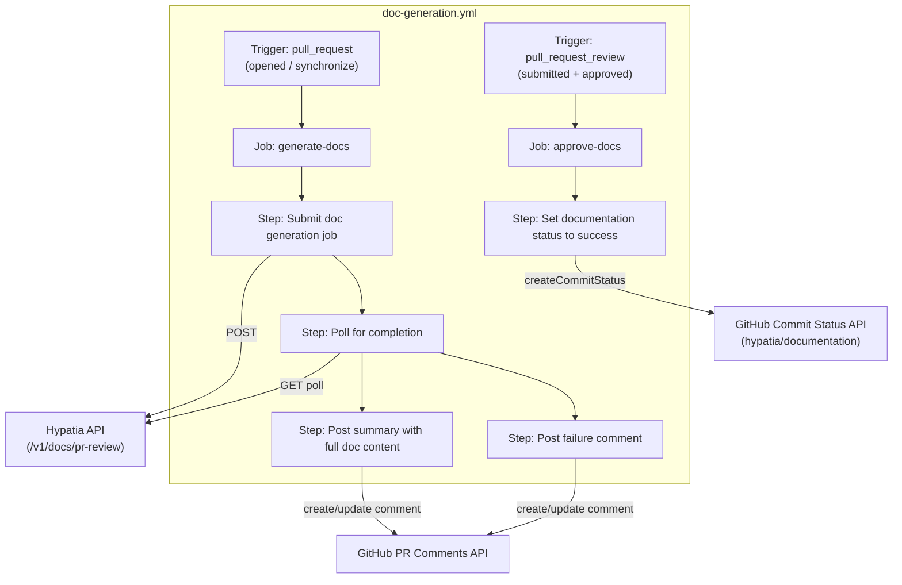
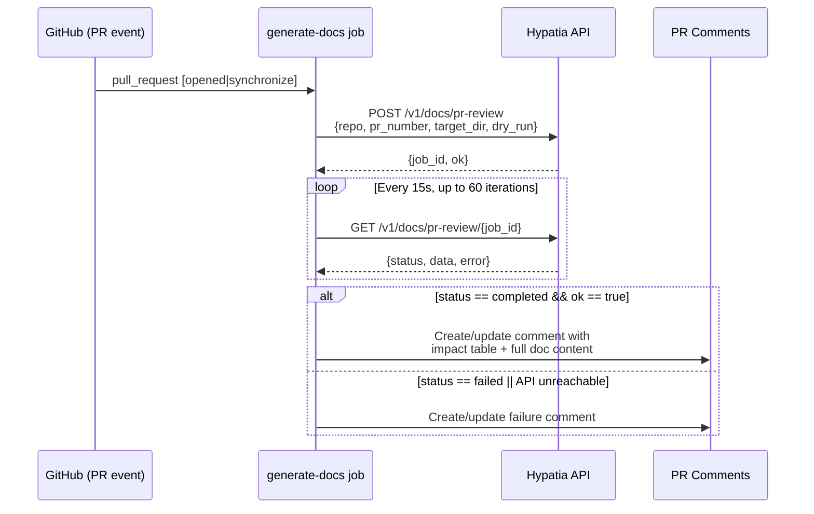
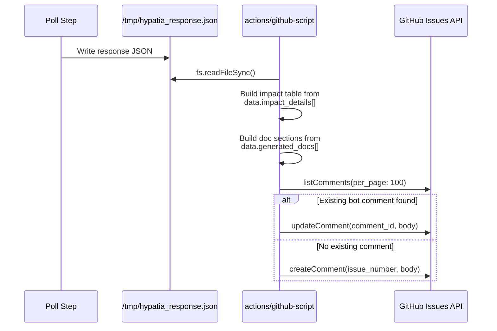
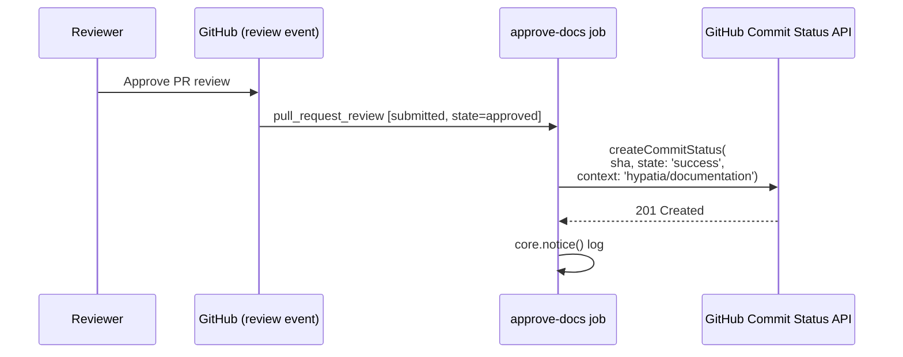

<!-- Generated by Documentation Agent — do not edit between markers -->

```yaml
---
title: "As-Built: GitHub Workflows"
date: "2026-04-02"
status: "draft"
---
```

## 1. Module Overview

The `.github/workflows/` directory contains a single GitHub Actions workflow file, `doc-generation.yml`, that integrates the **Hypatia** external documentation-generation service into the pull request lifecycle of the `opa-psm2-tests` repository. When a PR is opened or updated, the workflow submits the PR metadata to the Hypatia API, polls for completion, and posts the generated documentation content as a PR comment. Documentation remains gated behind a `hypatia/documentation` commit status check: the status stays **pending** until a human reviewer approves the PR, at which point a second job flips the status to **success** and unblocks merge.

## 2. What Changed

- **Before:** No automated documentation workflow existed in this repository.
- **After:** The new `doc-generation.yml` workflow adds two jobs — `generate-docs` (submit → poll → comment) and `approve-docs` (set commit status on approval) — providing a full documentation-as-code gate on every pull request.
- **Impact:** All pull requests now trigger an outbound call to the Hypatia API at `https://hypatia.cn-agents.com` (or a custom URL via the `HYPATIA_API_URL` secret). Merge is blocked until a reviewer approves the PR, which transitions the `hypatia/documentation` status check. Repository collaborators need `contents: write`, `pull-requests: write`, and `statuses: write` permissions granted to the workflow's `GITHUB_TOKEN`.

## 3. Component Diagram



## 4. Key Flows

### 4.1 Documentation Generation on PR Open/Update

When a pull request is opened or synchronized (new commits pushed), the `generate-docs` job fires. It submits a job to Hypatia, polls until completion or timeout, and posts results as a PR comment.



**Details:** The submit step (`id: submit`) sends a `POST` to `${HYPATIA_URL}/v1/docs/pr-review` with the repository name, PR number, target directory `"docs"`, and `dry_run: false`. On success it captures `job_id` and `api_ok`. The poll step (`id: poll`) issues `GET` requests every 15 seconds for up to 60 iterations (15-minute ceiling). The response JSON is saved to `/tmp/hypatia_response.json` for consumption by subsequent steps.

### 4.2 PR Comment Rendering (Success Path)

When polling completes successfully, the `Post summary with full doc content` step reads the saved JSON and constructs a rich Markdown comment.



**Details:** The script searches for an existing comment by `github-actions[bot]` containing one of three marker strings: `'Documentation Generated'`, `'No documentation impact'`, or `'Documentation analysis'`. If found, it updates in place; otherwise it creates a new comment. Each generated doc is rendered inside a `<details>` collapsible block with links to the blob on the branch and at the specific commit SHA.

### 4.3 Documentation Approval Gate

When a reviewer approves the PR, the `approve-docs` job sets the `hypatia/documentation` commit status to `success`, unblocking merge.



**Details:** The job condition (line 240–243) ensures it only runs when `github.event.review.state == 'approved'`. The status is set on `pr.head.sha`, the HEAD commit of the PR branch at the time of approval.

## 5. Data Model

The workflow does not maintain persistent state. All data flows through ephemeral step outputs and a temporary file.

| Artifact | Location | Schema / Shape |
|---|---|---|
| Submit outputs | `steps.submit.outputs` | `hypatia_url` (string), `job_id` (string), `api_ok` ("true"/"false") |
| Poll outputs | `steps.poll.outputs` | `api_ok`, `doc_count`, `committed`, `commit_sha`, `error`, `done` |
| Hypatia response | `/tmp/hypatia_response.json` | `{ status, ok, data: { generated_docs[], impact_details[], files_committed, commit_sha, head_branch }, error }` |
| Generated doc entry | `data.generated_docs[i]` | `{ path, content, content_preview, content_length, record_id }` |
| Impact detail entry | `data.impact_details[i]` | `{ source, status, additions, deletions, doc_type, target }` |

## 6. Dependencies

| Dependency | Purpose | Version |
|---|---|---|
| `actions/github-script` | Execute inline JavaScript with the Octokit GitHub client | `v7` |
| `curl` | HTTP client for Hypatia API calls (submit + poll) | Runner default |
| `jq` | JSON parsing in shell steps | Runner default |
| Hypatia API (`/v1/docs/pr-review`) | External service that analyzes PR diffs and generates documentation | N/A (SaaS) |
| GitHub REST API (Issues, Repos) | Post PR comments and set commit statuses | N/A (platform) |

## 7. Configuration

| Parameter | Source | Default | Description |
|---|---|---|---|
| `HYPATIA_API_URL` | GitHub Actions secret | `https://hypatia.cn-agents.com` | Base URL of the Hypatia documentation service. Checked at line 46; falls back to the hardcoded default if the secret is empty. |
| `target_dir` | Hardcoded in submit payload | `"docs"` | Directory in the repo where generated docs are committed by Hypatia. |
| `dry_run` | Hardcoded in submit payload | `false` | Controls whether Hypatia actually commits files. |
| Concurrency group | Workflow-level | `doc-gen-<PR number>` | Ensures only one documentation run per PR; `cancel-in-progress: true` aborts stale runs. |
| `timeout-minutes` | Job-level | `20` (generate-docs), `5` (approve-docs) | Maximum wall-clock time for each job. |

## 8. Error Handling

The workflow employs a **graceful degradation** pattern — failures never block the PR, they only post informational comments.

| Failure Mode | Handling | Source Location |
|---|---|---|
| Hypatia API unreachable on submit | `curl -sf` fails; the `|| { ... }` block emits a `::warning`, sets `api_ok=false`, and exits 0 (no job failure). | Lines 48–63 |
| Individual poll request fails | `curl ... \|\| continue` — the loop silently retries on the next iteration. | Line 78 |
| Poll timeout (15 minutes) | After 60 iterations the loop exits, emits `::warning`, sets `api_ok=false`. | Lines 97–99 |
| Hypatia returns `status: failed` | The response is still saved; `api_ok` is read from the JSON. The failure comment step fires. | Lines 83–84 |
| Failure comment posting | The `Post failure comment` step fires when `api_ok` is not `'true'`. It constructs a one-line message with the error detail (if any) or a generic "API did not respond" fallback. | Lines 195–225 |
| Comment idempotency | Both success and failure comment steps search for an existing bot comment by marker strings before deciding to update vs. create, preventing duplicate comments on re-runs. | Lines 170–185, 210–220 |

There is **no authentication** on the Hypatia API calls — no `Authorization` header or token is sent. The API is called over HTTPS but relies solely on the public endpoint being available.

## 9. Known Limitations / Technical Debt

1. **Hardcoded default URL** — The fallback `https://hypatia.cn-agents.com` is hardcoded at line 48. If the service moves, every repository using this workflow must either set the secret or update the file.

2. **No API authentication** — The `curl` calls to Hypatia include no bearer token, API key, or other credential. The service is called unauthenticated over HTTPS. This may be intentional (public endpoint) but limits the ability to enforce access control.

3. **Missing error handling on comment API calls** — The `actions/github-script` steps that call `github.rest.issues.listComments`, `createComment`, and `updateComment` have no `try/catch` blocks. A GitHub API failure (rate limit, network error) will cause the step to fail with an unhandled exception.

4. **Poll loop has no exponential backoff** — The poll interval is a fixed 15-second sleep for up to 60 iterations. Under sustained load or slow jobs, this generates up to 60 HTTP requests with no backoff.

5. **`/tmp` file coupling between steps** — The poll step writes to `/tmp/hypatia_response.json` and the comment step reads it. This works because both steps run in the same job, but the coupling is implicit and fragile if steps are ever reordered or split across jobs.

6. **Comment marker string fragility** — Comment deduplication relies on searching for the substrings `'Documentation Generated'`, `'No documentation impact'`, and `'Documentation analysis'` in existing comments. If a human or another bot posts a comment containing these phrases, the logic may incorrectly match it.

7. **`approve-docs` job does not verify documentation was generated** — The `approve-docs` job unconditionally sets the `hypatia/documentation` status to `success` on any PR approval, even if the `generate-docs` job never ran or failed. There is no check that documentation was actually produced.

8. **Actor exclusion list is minimal** — Only `github-actions[bot]` and `scm-bot` are excluded from triggering the `generate-docs` job (line 33–35). If Hypatia commits to the PR branch (as designed), and the committer is a different bot account, the workflow could re-trigger in a loop.

<!-- End Documentation Agent generated content -->