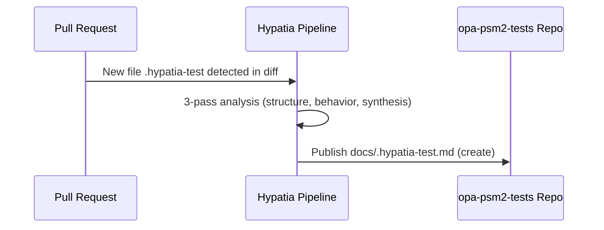

# .Hypatia Test Documentation — As-Built Design Reference

## 3-Pass Analysis

### PASS 1: Structure Discovery

| Module ID | Layer | Capability | Responsibility | Dependencies | Design Patterns |
|-----------|-------|------------|----------------|--------------|-----------------|
| `.hypatia-test` | Utility | Test marker | Serves as a documentation generation test artifact for the Hypatia system within the `opa-psm2-tests` repository. | None | None |

### PASS 2: Behavior Tracing

No functional flows exist. The file contains a single plaintext comment line with no executable code, no configuration, and no data structures.

### PASS 3: Synthesis

The synthesis below reflects strictly what exists in the source.

---

## 1. Module Overview

The `.hypatia-test` file located at `cornelisnetworks/opa-psm2-tests:.hypatia-test` is a non-functional test artifact used to validate the Hypatia documentation generation pipeline. It contains a single line of plaintext indicating its purpose and its ephemeral nature. It carries no executable logic, no configuration, and no data model. Its sole purpose is to confirm that the Hypatia toolchain can detect a source file, process it through the 3-pass analysis methodology, and produce a correctly structured Markdown output at the designated publication target.

## 2. Component Diagram

There is only one source component; the diagram above illustrates its role in the generation pipeline rather than any internal structure.

## 3. Key Flows

There are no runtime or data flows to document. The single relevant flow is the documentation generation trigger:

### Flow 1: Documentation Generation Validation

**Description:** When the `.hypatia-test` file appears in a PR diff, the Hypatia pipeline picks it up, performs its standard 3-pass analysis, and outputs a Markdown document to `docs/.hypatia-test.md`. This flow validates end-to-end pipeline operation.

**External calls:** None.

**Error boundaries:** None defined in the source.

## 4. Data Model

No data structures, state, or database schemas are defined by this file.

## 5. Dependencies

| Dependency | Purpose | Version |
|------------|---------|---------|
| None | — | — |

This file has zero internal or external dependencies.

## 6. Configuration

No environment variables, configuration files, or feature flags are required or referenced by this file.

## 7. Error Handling

No error handling patterns or exception hierarchies are present. The file contains no executable code.

## 8. Known Limitations / Technical Debt

| Item | Detail |
|------|--------|
| **Ephemeral artifact** | The file's own content states: *"this file can be removed after testing."* It is intended to be deleted once Hypatia pipeline validation is complete and should not persist in the repository long-term. |
| **No validation contract** | There is no machine-readable assertion or schema that confirms the pipeline operated correctly — success is determined solely by whether the output Markdown file is created. A future improvement would be to include a checksum or expected-output marker. |
| **No anti-patterns detected** | The file is a single line of plaintext; none of the flagged anti-patterns (god classes, circular dependencies, missing error handling on external calls, hardcoded credentials/URLs) apply. |

---

*Generated by Hypatia 3-pass analysis from source file `cornelisnetworks/opa-psm2-tests:.hypatia-test`. All claims are strictly grounded in the provided source content.*