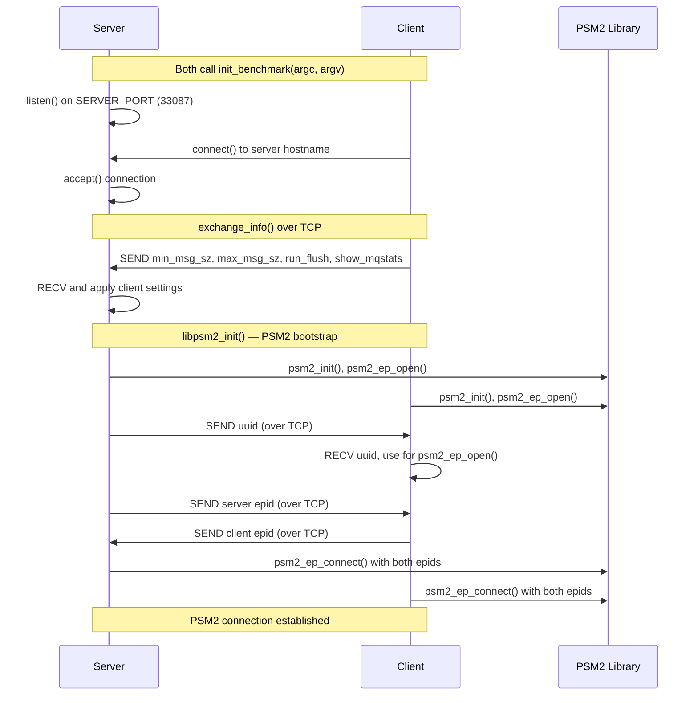
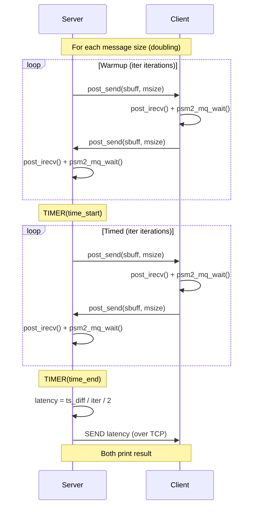
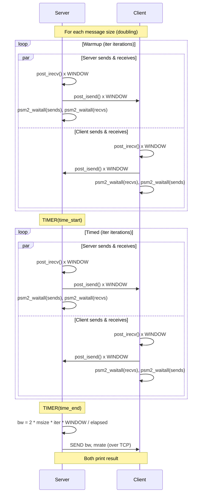

# Opa Psm2 Tests — Design Reference

## Module Overview

The `opa-psm2-tests` module is a performance benchmarking suite for the PSM2 (Performance Scaled Messaging 2) communication library used with Cornelis Networks / Intel Omni-Path Architecture (OPA) fabric adapters. It provides three distinct micro-benchmarks — ping-pong latency, unidirectional bandwidth with message rate, and bidirectional bandwidth with message rate — all built on a shared infrastructure layer. The infrastructure handles PSM2 endpoint lifecycle management, TCP-based out-of-band coordination between a server and client process, command-line argument parsing, and common timing/utility functions. The suite is designed for two-process (one server, one client) operation across an OPA fabric link.

## Component Diagram

```mermaid
graph TD
    subgraph Benchmark Executables
        LAT[latency.c<br/>Ping-Pong Latency]
        BW[bw-mrate.c<br/>Unidirectional BW & MRate]
        BIBW[bi-bw-mrate.c<br/>Bidirectional BW & MRate]
    end

    subgraph Infrastructure Library
        LIBPSM2_C[libpsm2.c<br/>PSM2 Lifecycle Management]
        LIBPSM2_H[libpsm2.h<br/>PSM2 API Wrappers & Inline Helpers]
        PERF_C[psm2perf.c<br/>Benchmark Init, Socket, Config Exchange]
        PERF_H[psm2perf.h<br/>Constants, Macros, Data Structures]
    end

    subgraph External Dependencies
        PSM2_LIB[libpsm2 / PSM2 API<br/>psm2.h, psm2_mq.h]
        SOCKETS[POSIX Sockets<br/>Out-of-Band Control Channel]
        PROCFS[/proc/cpuinfo<br/>CPU Frequency Detection]
    end

    LAT --> LIBPSM2_H
    LAT --> PERF_H
    BW --> LIBPSM2_H
    BW --> PERF_H
    BIBW --> LIBPSM2_H
    BIBW --> PERF_H

    LIBPSM2_C --> PSM2_LIB
    LIBPSM2_C --> PERF_H
    PERF_C --> SOCKETS
    PERF_C --> PROCFS

    LIBPSM2_H --> PSM2_LIB
```

## Key Flows

### 1. Benchmark Initialization and PSM2 Connection Setup

This flow is common to all three benchmarks. The client process specifies the server hostname as a positional argument; the server process runs with no positional arguments. Both processes parse arguments, establish a TCP socket, exchange configuration, initialize PSM2, exchange endpoint IDs, and connect.



### 2. Ping-Pong Latency Measurement

The server sends a message and waits for a reply; the client receives and immediately echoes back. The server times the round-trip and divides by two to obtain one-way latency. Message sizes double from `min_msg_sz` to `max_msg_sz`.



### 3. Bidirectional Bandwidth / Message Rate Measurement

Both sides simultaneously send and receive windows of messages. The server performs a warmup pass, then a timed pass. The client runs `2 * iter` iterations (covering both warmup and timed phases). Bandwidth and message rate are computed from the timed interval on the server and shared via TCP.



## Data Model

### `struct benchmark_info` (defined in `psm2perf.h`)

The central configuration structure shared between server and client:

| Field | Type | Description |
|---|---|---|
| `cpu_freq` | `double` | CPU frequency in Hz, read from `/proc/cpuinfo` |
| `hostname` | `char[256]` | Local hostname |
| `server` | `char[256]` | Server hostname (used for socket connection) |
| `is_server` | `int` | 1 if this process is the server, 0 if client |
| `partner` | `int` | PSM2 rank index of the remote peer (server=1, client=0) |
| `min_msg_sz` | `long` | Starting message size in bytes (default 1) |
| `max_msg_sz` | `long` | Ending message size in bytes (default 4 MiB) |
| `run_flush` | `int` | Whether to flush L3 cache before benchmarking |
| `show_mqstats` | `int` | Whether to print PSM2 MQ statistics after benchmarking |

### Global PSM2 State (defined in `libpsm2.c`, declared in `libpsm2.h`)

| Variable | Type | Description |
|---|---|---|
| `libpsm2_ep` | `psm2_ep_t` | The local PSM2 endpoint handle |
| `libpsm2_mq` | `psm2_mq_t` | The PSM2 matched queue handle |
| `libpsm2_epaddrs` | `psm2_epaddr_t*` | Array of resolved endpoint addresses (size `MAX_PSM2_RANKS` = 2) |
| `libpsm2_rank` | `int` | Local rank (server=0, client=1) |

### Global Buffers (defined in `psm2perf.h`)

| Variable | Type | Description |
|---|---|---|
| `sbuff` | `char[MAX_MSG_SZ]` | Send buffer (4 MiB, statically allocated) |
| `rbuff` | `char[MAX_MSG_SZ]` | Receive buffer (4 MiB, statically allocated) |

### Benchmark Constants

| Constant | Value | Description |
|---|---|---|
| `WINDOW` | 64 | Number of outstanding send/recv operations per iteration |
| `ITERS_LARGE` | 50,000 | Iteration count for small messages |
| `ITERS_MEDIUM` | 500 | Iteration count for unidirectional BW small messages |
| `ITERS_SMALL` | 50 | Iteration count for large messages (> 64 KiB) |
| `LARGE_MSG` | 65,536 | Threshold for switching iteration counts |
| `SERVER_PORT` | 33,087 | TCP port for out-of-band coordination |

## Dependencies

| Dependency | Purpose | Version |
|---|---|---|
| `libpsm2` (`psm2.h`, `psm2_mq.h`) | PSM2 messaging API for OPA fabric communication | `PSM2_VERNO_MAJOR` / `PSM2_VERNO_MINOR` (runtime negotiated) |
| POSIX Sockets (`sys/socket.h`, `netinet/in.h`, `netdb.h`) | Out-of-band TCP control channel between server and client | POSIX |
| `clock_gettime` (`time.h`, `CLOCK_MONOTONIC`) | High-resolution timing for benchmark measurements | POSIX |
| `sysconf` (`unistd.h`, `_SC_LEVEL3_CACHE_SIZE`) | L3 cache size detection for cache flush | POSIX |
| `/proc/cpuinfo` | CPU frequency detection via `get_cpu_rate()` | Linux procfs |
| `getopt_long` (`getopt.h`) | Command-line argument parsing | GNU C Library |
| Standard C Library (`stdio.h`, `stdlib.h`, `string.h`, `errno.h`) | General utilities | C99 |

## Configuration

### Command-Line Arguments

| Argument | Type | Default | Description |
|---|---|---|---|
| `[server]` | Positional | *(none — makes this process the server)* | Server hostname; providing it designates this process as the client |
| `-m` | Option | `1` | Starting message size in bytes |
| `-M` | Option | `4194304` (4 MiB) | Ending message size in bytes |
| `-f` / `--flush` | Flag | Off | Flush L3 cache before running the benchmark |
| `--mqstats` | Flag | Off | Print PSM2 MQ statistics after the benchmark |
| `-h` / `--help` | Flag | — | Print usage information |

### Hardcoded Configuration

| Parameter | Value | Location |
|---|---|---|
| `SERVER_PORT` | 33087 | `psm2perf.h` |
| `MAX_PSM2_RANKS` | 2 | `libpsm2.h` |
| `WINDOW` | 64 | `psm2perf.h` |
| `MAX_MSG_SZ` | 4 MiB | `psm2perf.h` |
| `PSM2_TAG` / `PSM2_TAGSEL` | `0xF` | `libpsm2.h` |

### Environment Variables

No environment variables are explicitly read by this module. However, the underlying `libpsm2` library respects numerous `PSM2_*` environment variables (e.g., `PSM2_DEVICES`, `PSM2_TRACEMASK`) which affect runtime behavior.

## Error Handling

The module uses a consistent **goto-bail** error handling pattern across all files:

- **`libpsm2_init()`**: Each PSM2 API call is checked against `PSM2_OK`. On failure, the `PSM2_ERR` macro prints the PSM2 error string to stderr, and execution jumps to a `bail` label that frees all allocated resources, finalizes any partially-initialized PSM2 state, and returns `-1`.

- **`init_benchmark()`**: Argument parsing errors, `gethostname()` failures, and CPU frequency detection failures all jump to `bail`, which frees the `benchmark_info` struct and returns `NULL`.

- **`open_socket()`**: Socket operations (`socket()`, `bind()`, `listen()`, `accept()`, `connect()`) are individually checked. Failures print via `perror()` and jump to `bail`, which closes the socket and returns `-1`.

- **`SEND` / `RECV` macros**: These macros wrap `send()` / `recv()` calls and jump to `bail` on failure via `goto`. This means any function using these macros **must** have a `bail` label in scope.

- **`main()` functions**: Each benchmark's `main()` follows the same pattern — check return values, `goto bail` on error, clean up socket and `benchmark_info` in the bail block.

- **`libpsm2_shutdown()`**: Logs but does not propagate `psm2_mq_finalize()` errors, as noted in the source comment.

There is no custom exception hierarchy; error signaling is purely via integer return codes (`0` for success, `-1` for failure) and `NULL` pointer returns.

## Known Limitations / Technical Debt

1. **Hardcoded `SERVER_PORT` (33087)**: The TCP port is a compile-time constant in `psm2perf.h`. There is no command-line option or environment variable to override it, which can cause conflicts in multi-user environments.

2. **`MAX_PSM2_RANKS` fixed at 2**: The suite only supports exactly two processes (one server, one client). Multi-node or multi-process scaling tests are not possible without code changes.

3. **Server socket file descriptor leak in `open_socket()`**: When `is_server` is true, the original listening socket returned by `socket()` is overwritten by the `accept()` return value. The listening socket is never closed.

4. **`SEND`/`RECV` macros assume complete transfer**: The macros call `send()` / `recv()` once and assume the entire `sizeof(type)` bytes are transferred. Partial sends/receives are not handled, which could cause subtle data corruption on congested or slow TCP connections.

5. **Global mutable state**: `sbuff`, `rbuff`, and `server_name` are declared as non-`static` globals in `psm2perf.h`, a header included by multiple translation units. This works only because each benchmark compiles into a separate executable, but would cause linker errors if combined.

6. **`libpsm2_mpi_rank` declared but never defined**: `libpsm2.h` declares `extern int libpsm2_mpi_rank`, but the implementation in `libpsm2.c` defines `int libpsm2_rank` instead. This is a naming mismatch; any code referencing `libpsm2_mpi_rank` would fail to link.

7. **`rank` parameter unused in `post_irecv()`**: The `rank` parameter is accepted but never used in the inline function body — `psm2_mq_irecv()` does not take a source address. This is misleading to callers.

8. **CPU frequency read from `/proc/cpuinfo` but never used in timing**: The `cpu_freq` field is populated via `get_cpu_rate()` but is not referenced by any benchmark calculation. All timing uses `CLOCK_MONOTONIC` via `clock_gettime()`. The `get_cycles()` inline (using `rdtsc`) is also defined but never called. These appear to be vestigial from an earlier cycle-counter-based timing approach.

9. **No data validation on received messages**: Benchmark buffers (`sbuff`, `rbuff`) are uninitialized and never verified for correctness. This is acceptable for performance testing but means the suite cannot detect silent data corruption.

10. **Unreachable `bail` labels**: In `run_latency()`, `run_bw_mrate()`, and `run_bi_bw_mrate()`, the `bail` label after `return 0` is unreachable under normal flow — it exists solely to satisfy the `SEND`/`RECV` macro `goto bail` pattern.

11. **`.hypatia-test` file**: This is a trivial test marker file with no functional content.