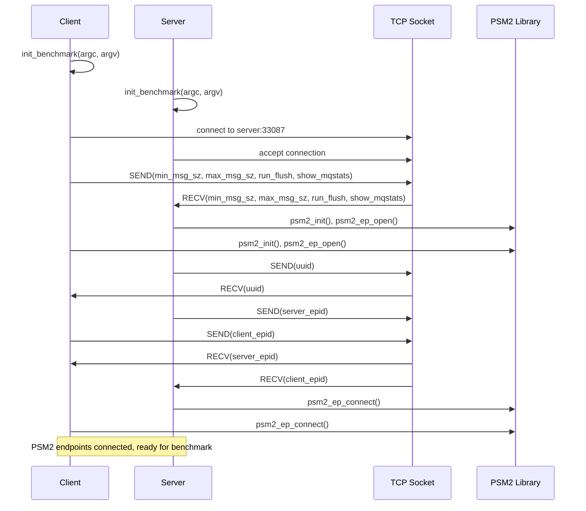
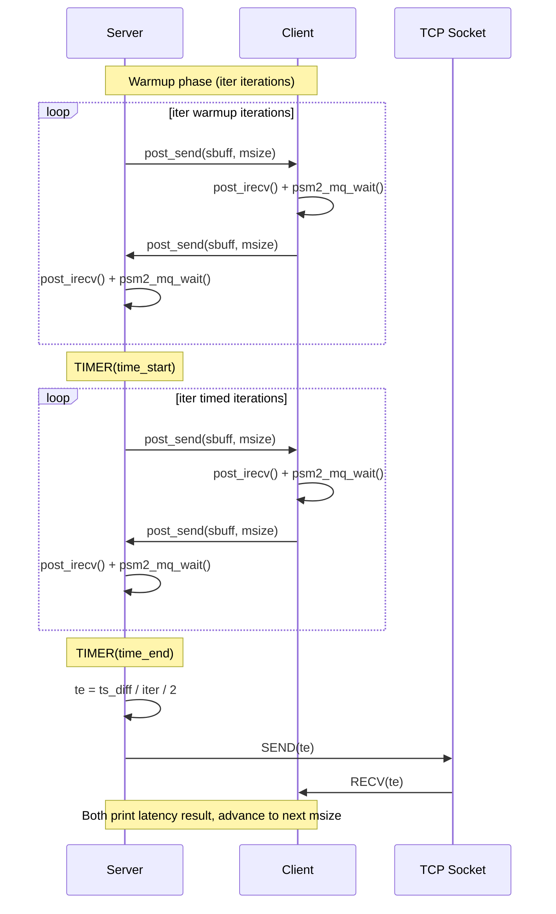
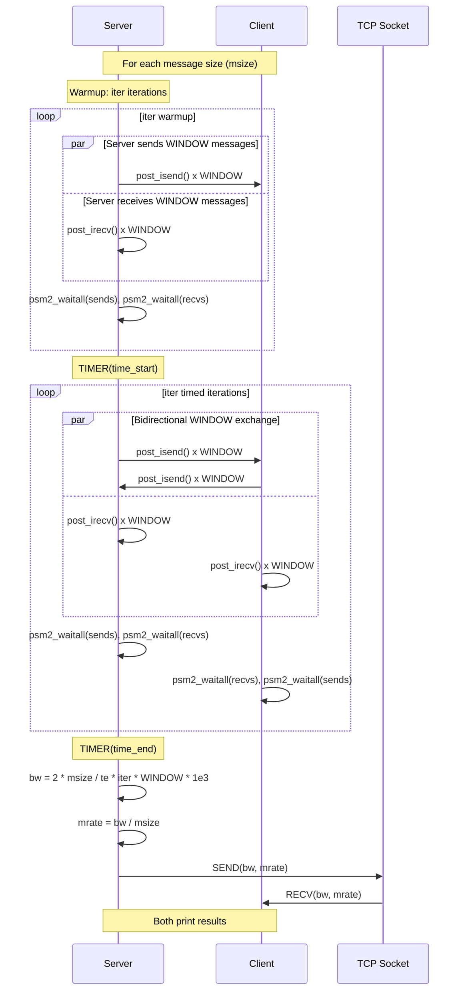

# Opa Psm2 Tests — Design Reference

## Module Overview

The `opa-psm2-tests` module is a performance benchmarking suite for the PSM2 (Performance Scaled Messaging 2) communication library used with Cornelis Networks / Intel Omni-Path Architecture (OPA) fabric adapters. It provides three distinct micro-benchmarks — ping-pong latency, unidirectional bandwidth with message rate, and bidirectional bandwidth with message rate — all built on a shared infrastructure layer. The infrastructure handles PSM2 endpoint lifecycle management, TCP-based out-of-band coordination between a server and client process, command-line argument parsing, timing utilities, and L3 cache flushing for measurement consistency. The suite operates in a two-process client/server model where the client specifies benchmark parameters, which are exchanged over a TCP socket before PSM2 endpoints are established and the measurement loop executes.

## Component Diagram

```mermaid
graph TD
    subgraph Benchmark Executables
        LAT[latency.c<br/>Ping-Pong Latency]
        BW[bw-mrate.c<br/>Unidirectional BW & MRate]
        BIBW[bi-bw-mrate.c<br/>Bidirectional BW & MRate]
    end

    subgraph Infrastructure Library
        LIBPSM2_C[libpsm2.c<br/>PSM2 Lifecycle Management]
        LIBPSM2_H[libpsm2.h<br/>PSM2 Inline Helpers & API]
        PERF_C[psm2perf.c<br/>Benchmark Init, Sockets, Config]
        PERF_H[psm2perf.h<br/>Constants, Macros, Data Structures]
    end

    subgraph External Dependencies
        PSM2_LIB[libpsm2 / psm2.h / psm2_mq.h<br/>PSM2 Runtime Library]
        POSIX[POSIX Sockets & Timers<br/>gethostbyname, clock_gettime]
        PROCFS[/proc/cpuinfo<br/>CPU Frequency Source]
    end

    LAT --> LIBPSM2_H
    LAT --> PERF_H
    BW --> LIBPSM2_H
    BW --> PERF_H
    BIBW --> LIBPSM2_H
    BIBW --> PERF_H

    LIBPSM2_C --> PSM2_LIB
    LIBPSM2_C --> PERF_H
    PERF_C --> POSIX
    PERF_C --> PROCFS
    LIBPSM2_H --> PSM2_LIB
```

## Key Flows

### 1. Benchmark Initialization and PSM2 Endpoint Setup

This flow is common to all three benchmarks. The client process specifies the server hostname as a positional argument; the server process runs with no positional arguments. After parsing, the client sends its configuration to the server over TCP. Both sides then initialize PSM2, exchange endpoint IDs over the same TCP socket, and connect their PSM2 endpoints.



### 2. Ping-Pong Latency Measurement

The server sends a message and waits for a reply; the client receives and immediately echoes back. The server times the round-trip over many iterations, divides by two to get one-way latency, and shares the result with the client over TCP for display.



### 3. Bidirectional Bandwidth / Message Rate Measurement

Both sides simultaneously send and receive windows of messages. The server performs a warmup pass, then a timed pass. The client runs for twice the iteration count (covering both warmup and timed phases). Bandwidth and message rate are computed from the elapsed time and exchanged over TCP.



## Data Model

### `struct benchmark_info` (defined in `psm2perf.h`)

The central configuration structure shared between server and client:

| Field | Type | Description |
|---|---|---|
| `cpu_freq` | `double` | CPU frequency in Hz, read from `/proc/cpuinfo` |
| `hostname` | `char[256]` | Local hostname |
| `server` | `char[256]` | Server hostname (used for TCP connection) |
| `is_server` | `int` | 1 if this process is the server, 0 if client |
| `partner` | `int` | PSM2 rank of the communication partner (0 or 1) |
| `min_msg_sz` | `long` | Starting message size in bytes (default 1) |
| `max_msg_sz` | `long` | Ending message size in bytes (default 4 MiB) |
| `run_flush` | `int` | Whether to flush L3 cache before the benchmark |
| `show_mqstats` | `int` | Whether to print PSM2 MQ statistics after the benchmark |

### Global Buffers (defined in `psm2perf.h`)

| Symbol | Type | Description |
|---|---|---|
| `sbuff` | `char[MAX_MSG_SZ]` | Send buffer (4 MiB, statically allocated) |
| `rbuff` | `char[MAX_MSG_SZ]` | Receive buffer (4 MiB, statically allocated) |

### PSM2 State (defined in `libpsm2.c` / `libpsm2.h`)

| Symbol | Type | Description |
|---|---|---|
| `libpsm2_ep` | `psm2_ep_t` | The local PSM2 endpoint handle |
| `libpsm2_mq` | `psm2_mq_t` | The PSM2 matched queue handle |
| `libpsm2_epaddrs` | `psm2_epaddr_t*` | Heap-allocated array of resolved endpoint addresses (size `MAX_PSM2_RANKS` = 2) |
| `libpsm2_rank` | `int` | Local rank: 0 for server, 1 for client |

## Dependencies

| Dependency | Purpose | Version |
|---|---|---|
| `libpsm2` (`psm2.h`, `psm2_mq.h`) | PSM2 runtime: endpoint management, matched queue send/recv, polling | `PSM2_VERNO_MAJOR` / `PSM2_VERNO_MINOR` (compile-time) |
| POSIX Sockets (`sys/socket.h`, `netinet/in.h`, `netdb.h`) | Out-of-band TCP coordination between server and client | POSIX |
| `clock_gettime` (`time.h`, `CLOCK_MONOTONIC`) | High-resolution timing for benchmark measurements | POSIX |
| `sysconf(_SC_LEVEL3_CACHE_SIZE)` | Query L3 cache size for cache-flush utility | POSIX |
| `/proc/cpuinfo` | Read CPU frequency (MHz) for `cpu_freq` field | Linux procfs |
| `getopt_long` (`getopt.h`) | Command-line argument parsing | GNU/POSIX |
| x86 `rdtsc` instruction | Cycle counter (defined in `libpsm2.h` via inline assembly, though not used in benchmark loops) | x86 ISA |

## Configuration

### Command-Line Arguments

| Argument | Description | Default |
|---|---|---|
| `[server]` (positional) | Hostname of the server node. Presence makes this process the client; absence makes it the server. | N/A |
| `-m <size>` | Minimum message size in bytes | `1` (`MIN_MSG_SZ`) |
| `-M <size>` | Maximum message size in bytes | `4194304` (`MAX_MSG_SZ`, 4 MiB) |
| `-f` / `--flush` | Flush L3 cache before running the benchmark | Disabled |
| `--mqstats` | Print PSM2 MQ statistics after the benchmark | Disabled |
| `-h` / `--help` | Print usage information | N/A |

### Compile-Time Constants (in `psm2perf.h`)

| Constant | Value | Description |
|---|---|---|
| `SERVER_PORT` | `33087` | TCP port for out-of-band coordination |
| `WINDOW` | `64` | Number of outstanding messages in bandwidth tests |
| `ITERS_SMALL` | `50` | Iteration count for large messages (> 64 KiB) |
| `ITERS_MEDIUM` | `500` | Iteration count for unidirectional BW (small messages) |
| `ITERS_LARGE` | `50000` | Iteration count for latency and bidirectional BW (small messages) |
| `LARGE_MSG` | `65536` | Threshold at which iteration count switches from large/medium to small |
| `MAX_PSM2_RANKS` | `2` | Only two-process (one server, one client) operation is supported |
| `MAX_CLIENTS` | `1` | TCP listen backlog |

### Environment Variables

The module itself does not read environment variables, but the underlying `libpsm2` runtime respects numerous `PSM2_*` environment variables (e.g., `PSM2_TRACEMASK`, `PSM2_MQ_RNDV_HFI_WINDOW`, etc.) that affect PSM2 behavior.

## Error Handling

The module uses a consistent `goto bail` pattern across all functions:

- **PSM2 API errors**: Checked against `PSM2_OK`. On failure, the `PSM2_ERR` macro prints the PSM2 error string to stderr, and control jumps to `bail` for cleanup.
- **Socket I/O errors**: The `SEND` and `RECV` macros (in `psm2perf.h`) check the return value of `send()`/`recv()`. On failure, they call `perror()` and `goto bail`. This requires every function using these macros to have a `bail` label.
- **Memory allocation errors**: `malloc` failures are checked with `perror()` and trigger `goto bail`.
- **Initialization failures**: `libpsm2_init` performs ordered cleanup on failure — freeing allocations, finalizing the MQ, closing the endpoint, and calling `psm2_finalize()`.
- **Shutdown**: `libpsm2_shutdown` logs but does not propagate `psm2_mq_finalize` errors, as noted in its comment.

There is no exception hierarchy; all errors propagate as integer return codes (`0` for success, `-1` for failure) back to `main`, which returns the code to the shell.

## Known Limitations / Technical Debt

1. **Hardcoded TCP port**: `SERVER_PORT` is hardcoded to `33087` in `psm2perf.h`. There is no command-line option or environment variable to override it, which can cause conflicts in shared environments.

2. **`MAX_PSM2_RANKS` fixed at 2**: The suite only supports a single server/client pair. The comment in `libpsm2.h` explicitly states "only one server/client supported now." Multi-node or multi-process scaling would require significant rework.

3. **Global mutable state via header-declared variables**: `sbuff`, `rbuff`, and `server_name` are declared as non-`static` global arrays in `psm2perf.h`. Since this header is included by multiple translation units that are linked into separate executables (not a single binary), this works in practice but is fragile — linking multiple benchmark objects together would cause symbol collisions.

4. **Unused `rank` parameter in inline helpers**: `post_irecv` accepts a `rank` parameter but does not use it (PSM2 `irecv` is matched by tag, not by source address). This is misleading to readers.

5. **Unused `get_cycles()` and `cpu_freq`**: The `get_cycles()` inline function (x86 `rdtsc`) is defined in `libpsm2.h` but never called. Similarly, `cpu_freq` is computed and stored in `benchmark_info` but never referenced by any benchmark. These appear to be remnants of an earlier cycle-counter-based timing approach that was replaced by `clock_gettime(CLOCK_MONOTONIC)`.

6. **Missing error handling on `recv()`/`send()` partial transfers**: The `SEND` and `RECV` macros check for `-1` (error) but do not handle short reads/writes. A `recv()` returning fewer bytes than `sizeof(type)` would silently produce corrupt data.

7. **Server socket file descriptor leak**: In `open_socket`, when `is_server` is true, the original listening socket file descriptor is replaced by the accepted socket. The listening socket is never closed.

8. **Unreachable `bail` labels in benchmark functions**: In `run_latency`, `run_bw_mrate`, and `run_bi_bw_mrate`, the `bail` label exists after `return 0` but is only reachable via the `SEND`/`RECV` macros' `goto bail`. The functions always return 0 on the normal path, and the `bail` path is only triggered by socket I/O failure during result exchange — not by PSM2 errors within the measurement loop.

9. **`gethostbyname` usage**: The code uses the deprecated, non-thread-safe `gethostbyname()` instead of `getaddrinfo()`.

10. **`.hypatia-test` file**: This is a trivial test marker file containing a single descriptive line. It has no functional role in the module.