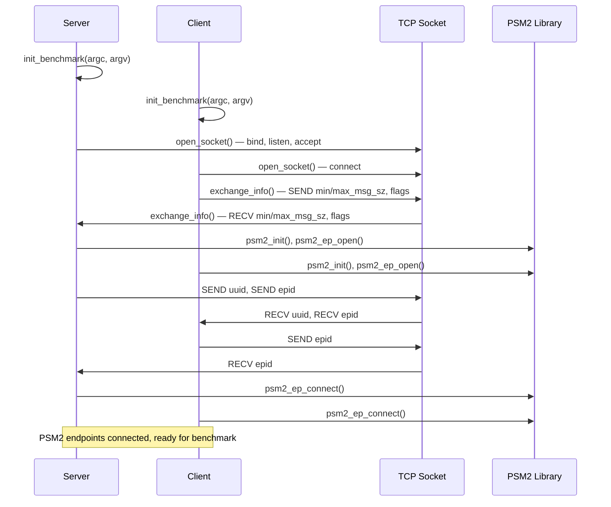
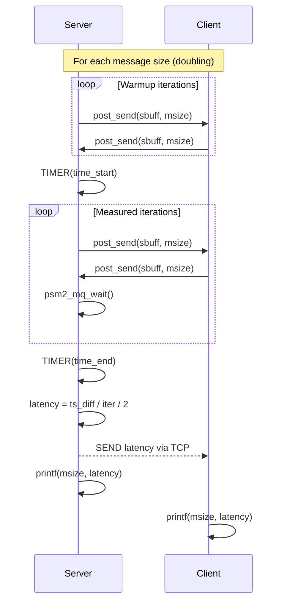
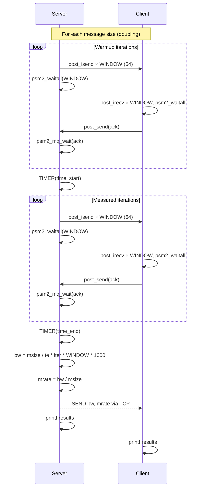

# Opa Psm2 Tests — Design Reference

## Module Overview

The `opa-psm2-tests` module is a performance benchmarking suite for the PSM2 (Performance Scaled Messaging 2) communication library used with Cornelis Networks / Intel Omni-Path Architecture (OPA) fabric adapters. It provides three distinct micro-benchmarks — ping-pong latency, unidirectional bandwidth with message rate, and bidirectional bandwidth with message rate — all built on a shared infrastructure layer. The infrastructure handles PSM2 endpoint lifecycle management, TCP-based out-of-band coordination between a server and client process, command-line argument parsing, and common timing/utility functions. The suite is designed for two-process (one server, one client) operation across an OPA fabric link.

## Component Diagram

```mermaid
graph TD
    subgraph Benchmark Executables
        LAT[latency.c<br/>Ping-Pong Latency]
        BW[bw-mrate.c<br/>Unidirectional BW & MRate]
        BIBW[bi-bw-mrate.c<br/>Bidirectional BW & MRate]
    end

    subgraph Infrastructure Library
        LIBPSM2_C[libpsm2.c<br/>PSM2 Lifecycle Management]
        LIBPSM2_H[libpsm2.h<br/>PSM2 Wrapper API & Inline Helpers]
        PERF_C[psm2perf.c<br/>Benchmark Init, Socket, Config]
        PERF_H[psm2perf.h<br/>Constants, Macros, Data Structures]
    end

    subgraph External Dependencies
        PSM2[PSM2 Library<br/>psm2.h / psm2_mq.h]
        POSIX[POSIX Sockets & Timers]
        PROC[/proc/cpuinfo]
    end

    LAT --> LIBPSM2_H
    LAT --> PERF_H
    BW --> LIBPSM2_H
    BW --> PERF_H
    BIBW --> LIBPSM2_H
    BIBW --> PERF_H

    LIBPSM2_C --> LIBPSM2_H
    LIBPSM2_C --> PERF_H
    PERF_C --> PERF_H

    LIBPSM2_H --> PSM2
    PERF_C --> POSIX
    PERF_C --> PROC
```

## Key Flows

### 1. Benchmark Initialization and PSM2 Endpoint Setup

This flow is common to all three benchmarks. The client process specifies the server hostname as a positional argument; the server process runs with no positional arguments. Both sides parse arguments, establish a TCP socket, exchange configuration, then initialize PSM2 endpoints and connect them.



### 2. Ping-Pong Latency Measurement

The server sends a message and waits for a reply; the client receives and immediately echoes back. The server times the round-trip over many iterations and divides by two to obtain one-way latency. Message sizes double from `min_msg_sz` to `max_msg_sz`.



### 3. Unidirectional Bandwidth / Message Rate Measurement

The server sends a window of messages (64 at a time) using non-blocking 'post_isend', waits for all to complete via 'psm2_waitall', then waits for an ACK from the client. The client posts a window of receives, waits, and sends back an ACK. The server times the measured iterations and computes bandwidth and message rate.



## Data Model

### `struct benchmark_info` (defined in `psm2perf.h`)

The central configuration structure shared between server and client:

| Field | Type | Description |
|---|---|---|
| `cpu_freq` | `double` | CPU frequency in Hz, read from `/proc/cpuinfo` |
| `hostname` | `char[256]` | Local hostname |
| `server` | `char[256]` | Server hostname (used for socket connection) |
| `is_server` | `int` | 1 if this process is the server, 0 for client |
| `partner` | `int` | PSM2 rank of the communication partner (0 or 1) |
| `min_msg_sz` | `long` | Minimum message size in bytes (default 1) |
| `max_msg_sz` | `long` | Maximum message size in bytes (default 4 MiB) |
| `run_flush` | `int` | Whether to flush L3 cache before benchmarking |
| `show_mqstats` | `int` | Whether to print PSM2 MQ statistics after run |

### Global Buffers (defined in `psm2perf.h`)

| Symbol | Type | Size | Description |
|---|---|---|---|
| `sbuff` | `char[]` | `MAX_MSG_SZ` (4 MiB) | Send buffer for all benchmarks |
| `rbuff` | `char[]` | `MAX_MSG_SZ` (4 MiB) | Receive buffer for all benchmarks |

### PSM2 State (managed in `libpsm2.c`)

| Symbol | Type | Description |
|---|---|---|
| `libpsm2_ep` | `psm2_ep_t` | The local PSM2 endpoint |
| `libpsm2_mq` | `psm2_mq_t` | The PSM2 matched queue |
| `libpsm2_epaddrs` | `psm2_epaddr_t*` | Array of resolved endpoint addresses (size `MAX_PSM2_RANKS` = 2) |
| `libpsm2_rank` | `int` | Local rank: 0 for server, 1 for client |

### Key Constants (defined in `psm2perf.h`)

| Constant | Value | Purpose |
|---|---|---|
| `WINDOW` | 64 | Number of outstanding messages in bandwidth tests |
| `ITERS_LARGE` | 50,000 | Iteration count for small messages |
| `ITERS_MEDIUM` | 500 | Iteration count for uni-directional BW small messages |
| `ITERS_SMALL` | 50 | Iteration count for large messages (> 64 KiB) |
| `LARGE_MSG` | 65,536 | Threshold for switching iteration counts |
| `SERVER_PORT` | 33,087 | TCP port for out-of-band coordination |
| `MAX_PSM2_RANKS` | 2 | Only two-process benchmarks supported |

## Dependencies

| Dependency | Purpose | Version |
|---|---|---|
| `psm2` (`psm2.h`, `psm2_mq.h`) | PSM2 endpoint management, matched queue messaging | System-installed (matches `PSM2_VERNO_MAJOR`/`PSM2_VERNO_MINOR`) |
| POSIX Sockets (`sys/socket.h`, `netinet/in.h`, `netdb.h`) | Out-of-band TCP coordination between server and client | POSIX |
| `clock_gettime` (`time.h`, `CLOCK_MONOTONIC`) | High-resolution timing for benchmark measurements | POSIX |
| `sysconf` (`unistd.h`, `_SC_LEVEL3_CACHE_SIZE`) | L3 cache size detection for cache flush | POSIX |
| `/proc/cpuinfo` | CPU frequency detection via `get_cpu_rate()` | Linux |
| `getopt_long` (`getopt.h`) | Command-line argument parsing | GNU/POSIX |
| Standard C library (`stdlib.h`, `stdio.h`, `string.h`, `errno.h`) | Memory allocation, I/O, string operations | C99 |

## Configuration

### Command-Line Arguments

| Argument | Type | Default | Description |
|---|---|---|---|
| `[server]` | Positional | *(none — makes this process the server)* | Server hostname; presence makes this process the client |
| `-m` | Option | `1` | Minimum message size in bytes |
| `-M` | Option | `4194304` (4 MiB) | Maximum message size in bytes |
| `-f` / `--flush` | Flag | Off | Flush L3 cache before running the benchmark |
| `--mqstats` | Flag | Off | Print PSM2 MQ statistics after the benchmark |
| `-h` / `--help` | Flag | — | Print usage and exit |

### Implicit Configuration

| Item | Source | Description |
|---|---|---|
| CPU frequency | `/proc/cpuinfo` (`cpu MHz` field) | Read at startup; stored in `benchmark_info.cpu_freq` but not directly used in timing (timing uses `CLOCK_MONOTONIC`) |
| L3 cache size | `sysconf(_SC_LEVEL3_CACHE_SIZE)` | Used for cache flush; falls back to hardcoded 28 MiB if sysconf fails |
| `SERVER_PORT` | Hardcoded `33087` | TCP port for out-of-band socket |

### Environment Variables

No environment variables are explicitly read by this module. PSM2 itself may honor environment variables (e.g., `PSM2_DEVICES`, `HFI_UNIT`), but those are external to this codebase.

## Error Handling

The module uses a consistent **goto-bail** error handling pattern throughout:

- **`init_benchmark()`**: Returns `NULL` on any parsing or system call failure; the caller checks for `NULL` and exits.
- **`libpsm2_init()`**: Each PSM2 API call is checked against `PSM2_OK`. On failure, the `PSM2_ERR` macro prints the PSM2 error string to stderr, and control jumps to a `bail` label that frees allocated resources, finalizes any partially-initialized PSM2 state, and returns `-1`.
- **`open_socket()`**: Each socket operation (`bind`, `listen`, `accept`, `connect`) is checked; failures print via `perror()` and jump to `bail` which closes the socket.
- **`SEND` / `RECV` macros**: These macros wrap `send()`/`recv()` calls and `goto bail` on failure, printing via `perror()`. This means any function using these macros **must** have a `bail` label in scope.
- **`libpsm2_shutdown()`**: Explicitly notes in a comment that `psm2_mq_finalize` errors are logged but not propagated.
- **Benchmark run functions** (`run_latency`, `run_bw_mrate`, `run_bi_bw_mrate`): Each has a `bail` label returning `-1`, reachable via the `SEND`/`RECV` macros, though the main measurement loops themselves do not check individual PSM2 send/receive return values.

There is no custom exception hierarchy; error reporting relies on `perror()`, `fprintf(stderr, ...)`, and the `PSM2_ERR` macro.

## Known Limitations / Technical Debt

1. **Hardcoded TCP port**: `SERVER_PORT` is hardcoded to `33087` in `psm2perf.h`. There is no command-line option or environment variable to override it, which can cause conflicts in shared environments.

2. **Hardcoded L3 cache fallback**: When `sysconf(_SC_LEVEL3_CACHE_SIZE)` fails, the code falls back to a hardcoded `28 * 1024 * 1024` bytes (28 MiB), which may not match the actual hardware.

3. **MAX_PSM2_RANKS fixed at 2**: The comment in `libpsm2.h` states "only one server/client supported now." The architecture does not support multi-node or multi-process benchmarks without rework.

4. **Missing error handling on PSM2 send/receive in benchmark loops**: The inline wrappers `post_isend()`, `post_irecv()`, and `post_send()` in `libpsm2.h` discard the return value of `psm2_mq_isend()`, `psm2_mq_irecv()`, and `psm2_mq_send()`. Errors during the measurement phase would go undetected.

5. **Global mutable buffers declared in a header**: `sbuff`, `rbuff`, and `server_name` are defined (not merely declared) in `psm2perf.h`. Since this header is included by multiple translation units, this relies on C tentative definition rules and would cause linker errors in C++ or with stricter compilers. These should be declared `extern` in the header and defined in a single `.c` file.

6. **Declared but unused extern**: `libpsm2.h` declares `extern int libpsm2_mpi_rank` but the actual global defined in `libpsm2.c` is `libpsm2_rank` (no `_mpi_` prefix). The declared extern is never defined or used.

7. **`cpu_freq` computed but unused for timing**: The CPU frequency is read from `/proc/cpuinfo` and stored in `benchmark_info`, but all timing is done via `CLOCK_MONOTONIC` / `ts_diff()`. The `get_cycles()` inline function using `rdtsc` is also defined but never called. This is dead code.

8. **Socket resource leak in server path**: In `open_socket()`, when `is_server` is true, the original listening socket file descriptor is overwritten by the `accept()` return value and is never closed.

9. **Partial `recv()` not handled**: The `RECV` macro calls `recv()` once and checks only for `-1`. It does not handle partial reads (where `recv` returns fewer bytes than `sizeof(type)`), which can occur on TCP streams, potentially causing data corruption in the configuration exchange.

10. **`.hypatia-test` file**: This is a trivial test marker file containing a single descriptive line. It has no functional role in the module.