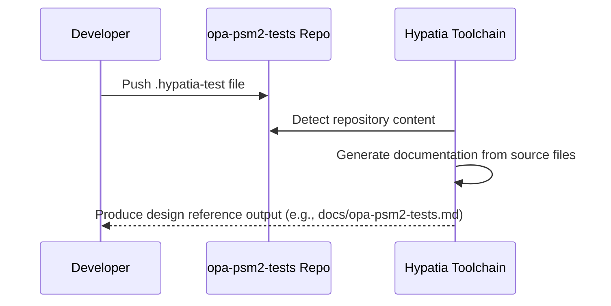
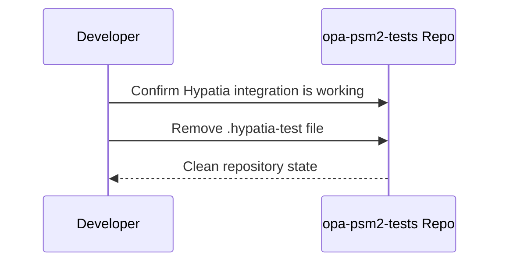
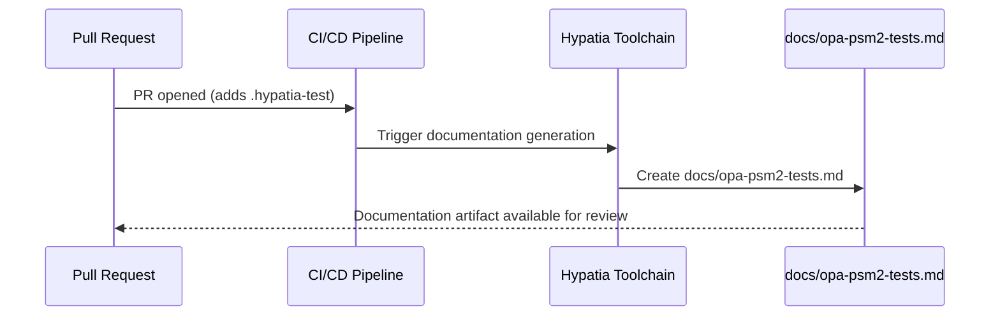

# Opa Psm2 Tests — Design Reference

## 1. Module Overview

The `opa-psm2-tests` repository is a test suite repository associated with Cornelis Networks' OPA PSM2 (Performance Scaled Messaging 2) library. Based on the sole source file present, the repository currently contains a Hypatia documentation generation test artifact (`.hypatia-test`). This file serves as a validation marker to confirm that the Hypatia documentation toolchain is correctly integrated with the repository and can be safely removed after testing is complete. No functional test code, test harnesses, or PSM2 integration logic is present in the provided source files.

## 2. Component Diagram

```mermaid
componentDiagram
    component "opa-psm2-tests Repository" {
        component ".hypatia-test" as hypatia [
            Hypatia documentation
            generation test marker
        ]
    }
    component "Hypatia Toolchain" as toolchain

    toolchain --> hypatia : reads / validates
```

## 3. Key Flows

### Flow 1: Hypatia Documentation Generation Validation



**Description:** A developer adds the `.hypatia-test` marker file to the repository. The Hypatia documentation toolchain detects the repository, processes its contents, and produces architecture/design documentation as output. This flow validates that the end-to-end documentation generation pipeline is operational for the `opa-psm2-tests` repository.

### Flow 2: Test Artifact Cleanup



**Description:** After confirming that the Hypatia toolchain successfully generates documentation, the developer removes the `.hypatia-test` file as indicated by its own content: *"this file can be removed after testing."*

### Flow 3: PR-Triggered Documentation Generation



**Description:** The PR diff context shows that `.hypatia-test` was added as a new file. This triggers the Hypatia toolchain (likely via CI integration) to produce the publication target `docs/opa-psm2-tests.md`.

## 4. Data Model

No data structures, state objects, or database schemas are present in the provided source files. The only artifact is a plain-text marker file (`.hypatia-test`) containing a single descriptive sentence.

## 5. Dependencies

| Dependency | Purpose | Version |
|---|---|---|
| Hypatia Toolchain | Documentation generation system that processes repository source files and produces architecture/design documents | Not specified |
| opa-psm2 (external) | The parent PSM2 library that this test repository is associated with; no direct code dependency is present in the provided files | Not specified |

## 6. Configuration

| Configuration Item | Type | Description |
|---|---|---|
| `.hypatia-test` | Marker file | Signals to the Hypatia toolchain that this repository is enrolled in documentation generation testing |
| Publication target: `docs/opa-psm2-tests.md` | Output path | The target path where generated documentation is written, specified as `repo_markdown -> docs/opa-psm2-tests.md (create)` |

No environment variables or feature flags are defined in the provided source files.

## 7. Error Handling

No error handling patterns or exception hierarchies are present in the provided source files. The repository contains only a plain-text test marker file with no executable code.

## 8. Known Limitations / Technical Debt

- **Temporary test artifact in repository root:** The `.hypatia-test` file is explicitly described as removable after testing (*"this file can be removed after testing"*). It should be cleaned up once Hypatia integration is confirmed to avoid confusion.
- **No functional test code present:** The repository is named `opa-psm2-tests` but contains no test source files, test harnesses, assertions, or PSM2 integration code in the provided source set. Either the test code was not included in this documentation request, or the repository is in an early bootstrapping phase.
- **Missing implementation:** No actual PSM2 test logic, build configuration, CI pipeline definitions, or test framework integration files are present in the provided sources.