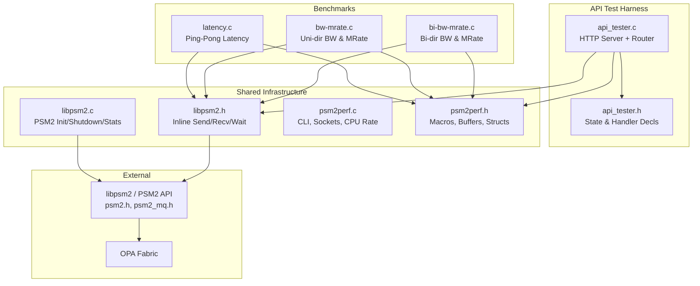
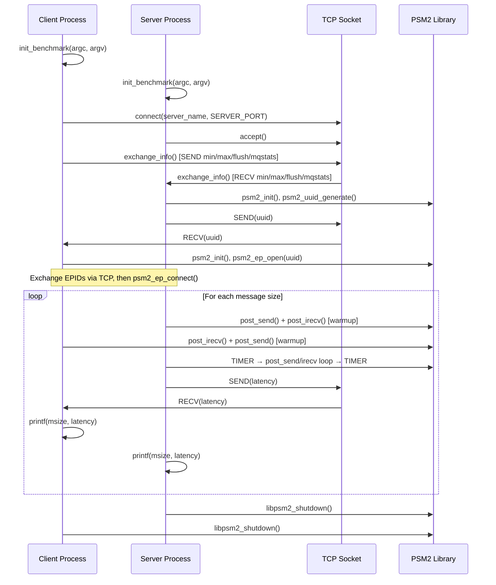
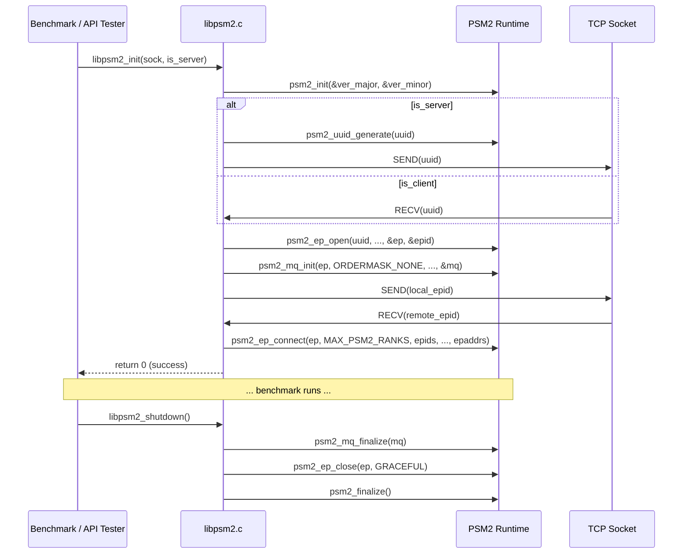
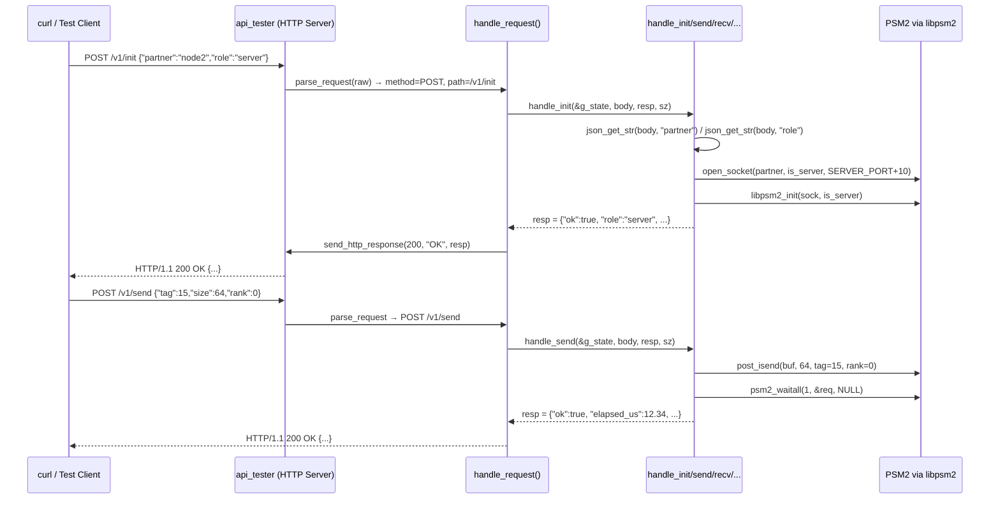

<!-- Generated by Documentation Agent — do not edit between markers -->

```yaml
---
title: "As-Built: Opa Psm2 Tests"
date: "2026-04-02"
status: "draft"
---
```

## 1. Module Overview

**opa-psm2-tests** is a suite of performance benchmarks and an HTTP-based API test harness for the PSM2 (Performance Scaled Messaging 2) library, used with Cornelis Networks OPA (Omni-Path Architecture) fabric adapters. The repository provides three standalone benchmark programs — ping-pong latency, unidirectional bandwidth/message-rate, and bidirectional bandwidth/message-rate — plus a REST API server (`api_tester`) that exposes PSM2 operations over HTTP for remote integration testing. All benchmarks share a common infrastructure layer: `libpsm2` (PSM2 lifecycle and messaging wrappers) and `psm2perf` (TCP socket coordination, CLI parsing, timing, and buffer management). The codebase operates in a two-rank (server/client) model where a TCP side-channel coordinates PSM2 endpoint setup and result exchange, while the PSM2 fabric carries the actual measured traffic.

## 2. What Changed

Not applicable — this document describes the repository's current as-built state.

## 3. Component Diagram



## 4. Key Flows

### 4.1 Benchmark Initialization and Execution (Latency Example)

Every benchmark follows an identical startup sequence: parse CLI → open TCP socket → exchange parameters → initialize PSM2 → run measurement loop → print results → shutdown.



**Description:** In `latency.c`, the server sends a message and immediately posts a receive; the client receives then echoes back. The round-trip time is halved to produce one-way latency. The `TIMER` macro wraps `clock_gettime(CLOCK_MONOTONIC)`, and `ts_diff()` computes elapsed nanoseconds. Results are synchronized over the TCP side-channel so both sides print identical output.

### 4.2 PSM2 Endpoint Lifecycle (`libpsm2_init` / `libpsm2_shutdown`)



**Description:** `libpsm2_init()` in `libpsm2.c` orchestrates the full PSM2 bring-up: version negotiation, UUID generation/exchange, endpoint opening, message-queue initialization, EPID exchange over TCP, and endpoint connection. The server generates the UUID; the client receives it. Both sides exchange EPIDs so `psm2_ep_connect()` can resolve addresses. Global variables `libpsm2_ep`, `libpsm2_mq`, and `libpsm2_epaddrs` hold the resulting handles, used by the inline send/recv wrappers in `libpsm2.h`.

### 4.3 API Tester HTTP Request Handling



**Description:** The `api_tester` in `api_tester/api_tester.c` implements a single-threaded HTTP/1.1 server. The `handle_request()` function routes based on method and path. Seven endpoints are defined: `GET /v1/health`, `GET /v1/status`, `GET /v1/stats`, `POST /v1/init`, `POST /v1/shutdown`, `POST /v1/send`, and `POST /v1/recv`. JSON parsing uses a minimal hand-rolled `json_find()` function that matches `"key":value` patterns in flat objects. All PSM2 operations go through the same `libpsm2` layer used by the benchmarks.

## 5. Data Model

### 5.1 `struct benchmark_info` (defined in `psm2perf.h`)

The central configuration structure shared by all benchmarks:

```c
struct benchmark_info {
    double cpu_freq;              /* CPU frequency in Hz (from /proc/cpuinfo) */
    char hostname[HOSTNAME_SZ];   /* Local hostname (256 chars)               */
    char server[HOSTNAME_SZ];     /* Server hostname for TCP connection       */
    int is_server;                /* 1 = server role, 0 = client role         */
    int partner;                  /* PSM2 rank of the remote side (0 or 1)    */

    /* Selected by client, sent to server via exchange_info() */
    long min_msg_sz;              /* Starting message size (default 1)        */
    long max_msg_sz;              /* Ending message size (default 4 MiB)      */
    int run_flush;                /* Flush L3 cache before benchmark          */
    int show_mqstats;             /* Print PSM2 MQ counters after run         */
};
```

### 5.2 `struct psm2_api_state` (defined in `api_tester/api_tester.h`)

Tracks the HTTP API server's PSM2 connection state:

```c
struct psm2_api_state {
    int    initialized;       /* 1 after successful libpsm2_init()       */
    int    is_server;         /* 1 = server role, 0 = client role        */
    int    ctrl_sock;         /* TCP control socket to partner           */
    char   partner[256];      /* hostname of the remote side             */
    double cpu_freq;          /* cycles/sec from /proc/cpuinfo           */
    struct timespec start_ts; /* server start time for uptime            */
};
```

### 5.3 PSM2 Global State (in `libpsm2.c`)

```c
int libpsm2_rank;                    /* 0 for server, 1 for client */
psm2_epaddr_t *libpsm2_epaddrs;     /* Heap-allocated, MAX_PSM2_RANKS entries */
psm2_ep_t libpsm2_ep;               /* PSM2 endpoint handle */
psm2_mq_t libpsm2_mq;              /* PSM2 matched queue handle */
static psm2_epid_t libpsm2_epid;    /* Local endpoint ID (file-scoped) */
```

### 5.4 Shared Buffers (in `psm2perf.h`)

```c
char sbuff[MAX_MSG_SZ];   /* 4 MiB send buffer — global, file-scope linkage */
char rbuff[MAX_MSG_SZ];   /* 4 MiB receive buffer                           */
```

## 6. Dependencies

| Dependency | Purpose | Version |
|---|---|---|
| `libpsm2` (`psm2.h`, `psm2_mq.h`) | PSM2 messaging API — endpoint management, matched queue send/recv | PSM2_VERNO_MAJOR / PSM2_VERNO_MINOR (runtime negotiated) |
| POSIX sockets (`sys/socket.h`, `netinet/in.h`, `netdb.h`) | TCP side-channel for coordination and result exchange | System |
| POSIX `clock_gettime` (`time.h`, `CLOCK_MONOTONIC`) | High-resolution timing for benchmark measurements | System |
| `getopt_long` (`getopt.h`) | CLI argument parsing in `psm2perf.c` | System (glibc) |
| `/proc/cpuinfo` | CPU frequency detection via `get_cpu_rate()` | Linux procfs |
| `sysconf(_SC_LEVEL3_CACHE_SIZE)` | L3 cache size for `flush_l3cache()` | System |
| `x86 rdtsc` instruction | Cycle counter (declared in `libpsm2.h`, `get_cycles()`) | x86 hardware |

## 7. Configuration

### 7.1 CLI Arguments (Benchmarks)

All three benchmarks (`latency`, `bw-mrate`, `bi-bw-mrate`) share the same CLI interface defined in `psm2perf.c`:

| Argument | Description | Default |
|---|---|---|
| `[server]` | Positional — server hostname. If absent, this process is the server. | (none — determines role) |
| `-m <size>` | Minimum message size in bytes | `MIN_MSG_SZ` = 1 |
| `-M <size>` | Maximum message size in bytes | `MAX_MSG_SZ` = 4194304 (4 MiB) |
| `-f` / `--flush` | Flush L3 cache before benchmark | disabled |
| `--mqstats` | Print PSM2 MQ statistics after run | disabled |
| `-h` / `--help` | Print usage | — |

### 7.2 Compile-Time Constants (`psm2perf.h`)

| Constant | Value | Purpose |
|---|---|---|
| `LARGE_MSG` | 65536 | Threshold to switch from high to low iteration count |
| `ITERS_SMALL` | 50 | Iteration count for large messages |
| `ITERS_MEDIUM` | 500 | Iteration count for uni-dir BW |
| `ITERS_LARGE` | 50000 | Iteration count for latency / bi-dir BW small messages |
| `SERVER_PORT` | 33087 | TCP coordination port |
| `MAX_CLIENTS` | 1 | TCP listen backlog |
| `WINDOW` | 64 | Number of outstanding PSM2 requests in BW tests |
| `MAX_PSM2_RANKS` | 2 | Only two-rank (server/client) supported |

### 7.3 API Tester Constants (`api_tester.h`)

| Constant | Value | Purpose |
|---|---|---|
| `API_DEFAULT_PORT` | 8080 | HTTP listen port |
| `API_MAX_REQUEST_SZ` | 4096 | Max HTTP request buffer |
| `API_MAX_RESPONSE_SZ` | 65536 | Max JSON response buffer |
| `API_MAX_CONNECTIONS` | 16 | Max concurrent connections (declared, not enforced — single-threaded) |
| `API_BACKLOG` | 8 | TCP listen backlog |
| `API_VERSION` | "1.0.0" | Reported in `/v1/health` |

### 7.4 Environment Variables

No environment variables are explicitly read by this codebase. PSM2 itself may honor `PSM2_*` environment variables (e.g., `PSM2_DEVICES`, `PSM2_TRACEMASK`), but those are external to this test suite.

## 8. Error Handling

### 8.1 PSM2 Errors

All PSM2 API calls are checked against `PSM2_OK`. On failure, the `PSM2_ERR` macro (defined in `libpsm2.h`) prints the PSM2 error string to stderr:

```c
#define PSM2_ERR(err, msg) fprintf(stderr, "%s %s\n", \
        msg, psm2_error_get_string(err));
```

`libpsm2_init()` performs cleanup on failure — freeing allocated memory, finalizing the MQ, closing the endpoint, and calling `psm2_finalize()` — before returning `-1`.

### 8.2 TCP Socket Errors

The `SEND` and `RECV` macros in `psm2perf.h` use `goto bail` on failure:

```c
#define SEND(sock, data, type)                        \
    do {                                              \
        if (send(sock, (void *)&data, sizeof(type), 0) == -1) { \
            perror("send");                           \
            goto bail;                                \
        }                                             \
    } while (0)
```

This pattern requires every function using these macros to have a `bail:` label. The benchmark `run_*` functions and `exchange_info()` all follow this convention.

### 8.3 API Tester Errors

The API tester uses JSON error responses via the `JSON_ERR` macro:

```c
#define JSON_ERR(buf, sz, msg) \
    snprintf(buf, sz, "{\"ok\":false,\"error\":\"%s\"}", msg)
```

Each handler validates preconditions (e.g., `st->initialized`) and returns an error JSON with an appropriate HTTP status code. The HTTP server itself uses `send()` without checking return values for the response write.

### 8.4 General Pattern

- **Benchmarks:** `goto bail` with cleanup and return `-1`.
- **API tester:** JSON error response with HTTP 400/404/500.
- **Memory allocation:** Checked with `perror()` + `goto bail` or `return NULL`.
- **File I/O:** `get_cpu_rate()` returns `0.0` on failure, which propagates up to abort benchmark init.

## 9. Known Limitations / Technical Debt

1. **Single-connection, single-threaded model:** `MAX_PSM2_RANKS` is hardcoded to `2` in `libpsm2.h`. The entire framework supports only one server and one client. Extending to multi-rank would require significant refactoring of the global state in `libpsm2.c`.

2. **Global mutable state in headers:** `psm2perf.h` declares global variables (`sbuff`, `rbuff`, `server_name`) without `extern`, relying on C tentative definition rules. These 8+ MiB buffers are defined in every translation unit that includes the header:
   ```c
   char sbuff[MAX_MSG_SZ];  /* 4 MiB — in a header file */
   char rbuff[MAX_MSG_SZ];
   char server_name[HOSTNAME_SZ];
   ```
   This will cause linker errors or undefined behavior if multiple `.c` files including `psm2perf.h` are linked together (which they are — `psm2perf.c` + each benchmark).

3. **Hardcoded port:** `SERVER_PORT` is `33087` and the API tester uses `SERVER_PORT + 10` (33097) for its control channel. These are not configurable at runtime.

4. **Missing error handling on HTTP `send()`:** In `api_tester.c`, `send_http_response()` calls `send()` without checking the return value:
   ```c
   send(client_fd, header, hlen, 0);
   if (body_len > 0)
       send(client_fd, body, body_len, 0);
   ```

5. **Incomplete request router:** The `handle_request()` function in `api_tester.c` is truncated in the source — the POST routing block and the closing of the function body appear to be cut off after the GET `/v1/stats` route. The file ends mid-function.

6. **No `main()` in `api_tester.c`:** The API tester source file does not contain a `main()` function or the server accept loop. Either the file is incomplete or `main()` resides in an unseen file.

7. **`RECV` macro does not handle partial reads:** The `RECV` macro calls `recv()` once and assumes the full `sizeof(type)` bytes arrive in a single call. For small types over a local TCP connection this is generally safe, but it is not robust against partial reads.

8. **`open_socket()` leaks the listening socket on server side:** After `accept()` returns a new file descriptor, the original listening socket is never closed:
   ```c
   sock = accept(sock, ...);  /* overwrites the listening fd */
   ```

9. **Latency test uses hardcoded tag `0xF`:** While the BW tests use the `PSM2_TAG` constant, `latency.c` hardcodes `0xF` directly in `post_send()` and `post_irecv()` calls rather than using the symbolic constant.

10. **`libpsm2_mpi_rank` declared but never defined:** `libpsm2.h` declares `extern int libpsm2_mpi_rank;` but `libpsm2.c` defines `int libpsm2_rank;` — a name mismatch. The `libpsm2_mpi_rank` symbol is never defined anywhere in the provided sources.

11. **`rank` parameter unused in inline wrappers:** Both `post_irecv()` and `post_isend()` in `libpsm2.h` accept a `rank` parameter, but `post_irecv()` ignores it entirely — it does not index into `libpsm2_epaddrs`:
    ```c
    static inline void post_irecv(void *buf, uint32_t len, uint64_t tag,
            uint64_t tagsel, uint32_t rank, psm2_mq_req_t *req)
    {
        psm2_mq_irecv(libpsm2_mq, tag, tagsel, 0, buf, len, NULL, req);
        /* rank is unused — irecv matches any source */
    }
    ```

12. **No TLS/authentication on API tester:** The HTTP server has no authentication mechanism. Anyone with network access to port 8080 can initialize PSM2 connections and send/receive messages.

<!-- End Documentation Agent generated content -->