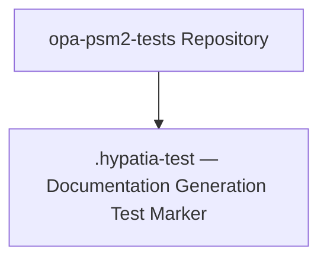
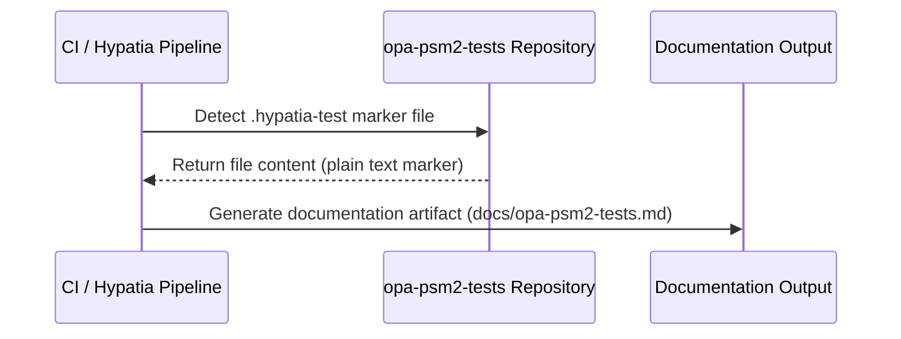

# Opa Psm2 Tests — Design Reference

## 1. Module Overview

The `opa-psm2-tests` repository is a test suite associated with the Cornelis Networks OPA PSM2 (Performance Scaled Messaging 2) library. Based on the sole source file provided, the repository currently contains a single placeholder file (`.hypatia-test`) used for validating the Hypatia documentation generation pipeline. No functional test code, test harnesses, or PSM2 integration logic is present in the provided source files.

## 2. Component Diagram

> **Note:** Only a single file was provided for analysis. The component diagram reflects the current minimal state of the repository as represented by the supplied source files.

## 3. Key Flows

### Flow 1: Hypatia Documentation Generation Validation

**Description:** The `.hypatia-test` file serves as a trigger or validation marker for the Hypatia documentation generation system. The CI pipeline detects the file, processes the repository, and produces a documentation artifact. The file itself explicitly states it "can be removed after testing," confirming its role as a transient pipeline validation artifact.

> **Note:** No additional functional flows (e.g., PSM2 test execution, result reporting) can be traced from the provided source files.

## 4. Data Model

No data structures, state objects, or database schemas are present in the provided source files. The sole file contains a single line of plain-text content with no structured data.

## 5. Dependencies

| Dependency | Purpose | Version |
|---|---|---|
| Hypatia (external) | Documentation generation pipeline that consumes this repository | Unknown |
| opa-psm2 (external, inferred) | The PSM2 library that this test repository is intended to validate | Unknown |

> **Note:** Dependencies are inferred from the repository name and context. No dependency manifests (e.g., `Makefile`, `requirements.txt`, `package.json`) were provided.

## 6. Configuration

No environment variables, configuration files, or feature flags are present in the provided source files.

The `.hypatia-test` file itself may function as a configuration marker — its presence in the repository root signals to the Hypatia pipeline that documentation generation should be performed.

## 7. Error Handling

No error handling patterns or exception hierarchies are present in the provided source files. The repository contains no executable code.

## 8. Known Limitations / Technical Debt

| Item | Category | Details |
|---|---|---|
| **Repository contains no functional test code** | Missing implementation | The provided source files contain only a documentation pipeline test marker. No PSM2 test logic, test fixtures, or test harnesses are present. |
| **Placeholder file intended for removal** | Technical debt | The `.hypatia-test` file explicitly states: *"this file can be removed after testing."* It should be removed once the Hypatia documentation generation pipeline has been validated. |
| **No dependency or build manifests** | Missing implementation | No `Makefile`, `CMakeLists.txt`, `requirements.txt`, or equivalent build/dependency configuration was provided, making it impossible to document the full dependency graph or build process. |
| **No error handling on any boundary** | Missing error handling | As no executable code exists in the provided files, there are no error handling patterns to evaluate. This should be addressed as functional test code is added. |

> **Disclaimer:** This document is based solely on the source files provided for analysis. The `opa-psm2-tests` repository likely contains additional test modules, build infrastructure, and PSM2 integration code that were not included in this documentation request. This document should be revised when additional source files become available.