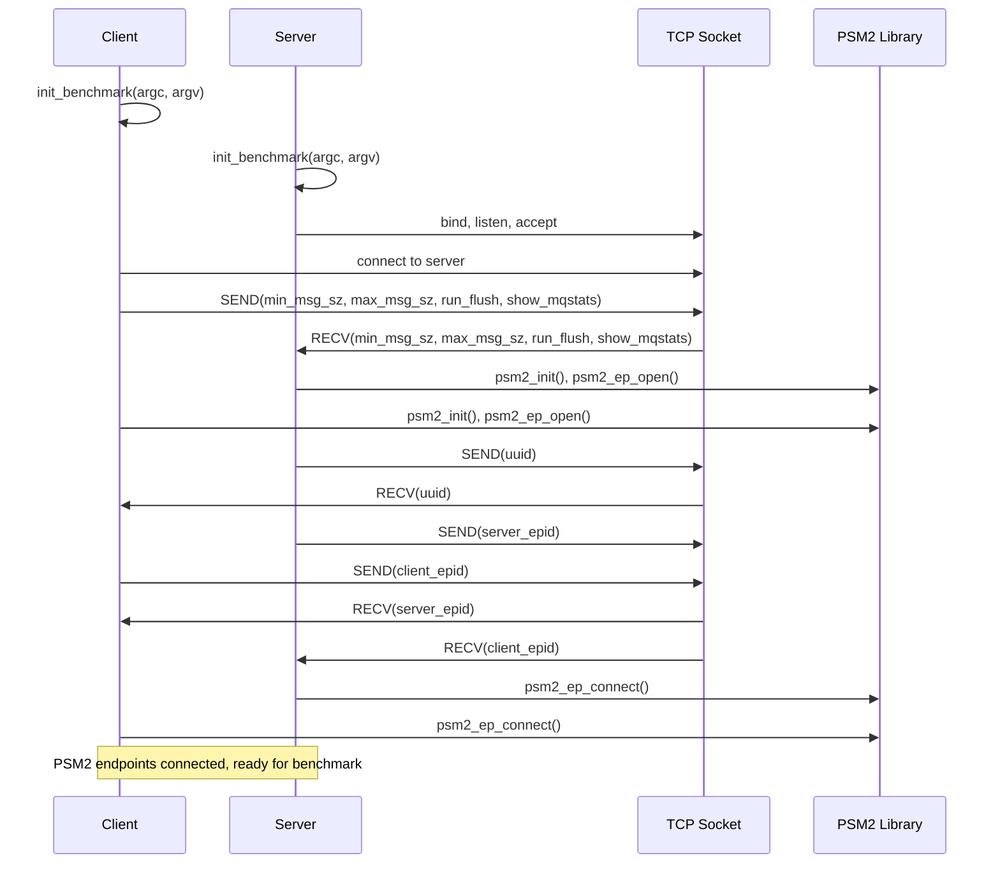
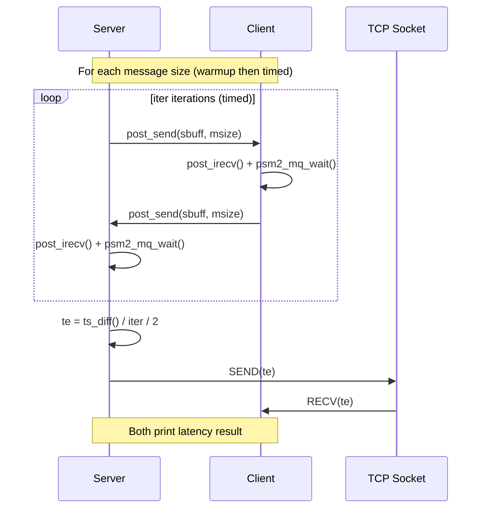
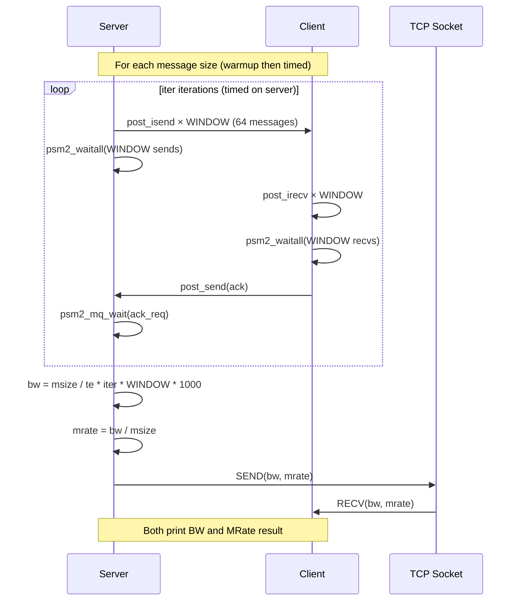

# Opa Psm2 Tests — Design Reference

## Module Overview

The `opa-psm2-tests` module is a performance benchmarking suite for the PSM2 (Performance Scaled Messaging 2) communication library used with Cornelis Networks / Intel Omni-Path Architecture (OPA) fabric adapters. It provides three distinct micro-benchmarks — ping-pong latency, unidirectional bandwidth with message rate, and bidirectional bandwidth with message rate — all built on a shared infrastructure layer. The infrastructure handles PSM2 endpoint lifecycle management, TCP-based out-of-band coordination between a server and client process, command-line argument parsing, and common timing/utility functions. The suite is designed for two-process (one server, one client) operation across an OPA fabric link.

## Component Diagram

```mermaid
graph TD
    subgraph Benchmark Executables
        LAT[latency.c<br/>Ping-Pong Latency]
        BW[bw-mrate.c<br/>Unidirectional BW & MRate]
        BIBW[bi-bw-mrate.c<br/>Bidirectional BW & MRate]
    end

    subgraph Infrastructure Library
        LIBPSM2_C[libpsm2.c<br/>PSM2 Lifecycle Management]
        LIBPSM2_H[libpsm2.h<br/>PSM2 Wrapper API & Inline Helpers]
        PERF_C[psm2perf.c<br/>Benchmark Init, Sockets, Config]
        PERF_H[psm2perf.h<br/>Constants, Macros, Data Structures]
    end

    subgraph External Dependencies
        PSM2[PSM2 Library<br/>psm2.h / psm2_mq.h]
        POSIX[POSIX Sockets & Timers]
        PROC[/proc/cpuinfo]
    end

    LAT --> LIBPSM2_H
    LAT --> PERF_H
    BW --> LIBPSM2_H
    BW --> PERF_H
    BIBW --> LIBPSM2_H
    BIBW --> PERF_H

    LIBPSM2_C --> PSM2
    LIBPSM2_C --> PERF_H
    PERF_C --> POSIX
    PERF_C --> PROC
    LIBPSM2_H --> PSM2
```

## Key Flows

### 1. Benchmark Initialization and PSM2 Endpoint Setup

This flow is common to all three benchmarks. The client and server processes parse arguments, establish a TCP socket for out-of-band coordination, exchange benchmark parameters, then initialize PSM2 — generating a UUID, opening endpoints, exchanging endpoint IDs over the socket, and connecting the PSM2 endpoints to each other.



### 2. Ping-Pong Latency Measurement

The server sends a message and waits for a reply; the client receives and immediately echoes back. The server times the round-trip over many iterations, divides by two to get one-way latency, and shares the result with the client over the TCP socket. Message sizes double from 'min_msg_sz' to 'max_msg_sz'.



### 3. Unidirectional Bandwidth / Message Rate Measurement

The server sends a window of messages ('WINDOW' = 64) asynchronously using 'post_isend', waits for all to complete, then waits for an ACK from the client. The client posts a window of receives, waits for completion, and sends the ACK. After warmup and timed iterations, the server computes bandwidth and message rate, then shares results over TCP.



## Data Model

### `struct benchmark_info`

The central configuration structure, defined in 'psm2perf.h', carries all state needed to coordinate a benchmark run:

| Field          | Type              | Description                                                    |
|----------------|-------------------|----------------------------------------------------------------|
| `cpu_freq`     | `double`          | CPU frequency in Hz, read from `/proc/cpuinfo`                 |
| `hostname`     | `char[256]`       | Local hostname of this process                                 |
| `server`       | `char[256]`       | Hostname of the server process (used for socket connection)    |
| `is_server`    | `int`             | 1 if this process is the server, 0 if client                  |
| `partner`      | `int`             | PSM2 rank index of the remote peer (server=1, client=0)       |
| `min_msg_sz`   | `long`            | Starting message size in bytes (default 1)                     |
| `max_msg_sz`   | `long`            | Ending message size in bytes (default 4 MiB)                   |
| `run_flush`    | `int`             | If set, flush L3 cache before benchmark                        |
| `show_mqstats` | `int`             | If set, print PSM2 MQ statistics after benchmark               |

### Global PSM2 State (in `libpsm2.c`)

| Variable            | Type               | Description                                      |
|---------------------|--------------------|--------------------------------------------------|
| `libpsm2_rank`      | `int`              | Local rank (0 for server, 1 for client)          |
| `libpsm2_epaddrs`   | `psm2_epaddr_t *`  | Array of resolved endpoint addresses (size 2)    |
| `libpsm2_ep`        | `psm2_ep_t`        | Local PSM2 endpoint handle                       |
| `libpsm2_mq`        | `psm2_mq_t`        | PSM2 matched queue handle                        |

### Global Buffers (in `psm2perf.h`)

| Variable       | Type               | Description                                       |
|----------------|--------------------|----------------------------------------------------|
| `sbuff`        | `char[4 MiB]`      | Send buffer, statically allocated at max msg size  |
| `rbuff`        | `char[4 MiB]`      | Receive buffer, statically allocated at max msg size|

## Dependencies

| Dependency         | Purpose                                                        | Version                |
|--------------------|----------------------------------------------------------------|------------------------|
| `psm2` (libpsm2)  | PSM2 API for endpoint management, matched queue messaging      | `PSM2_VERNO_MAJOR/MINOR` (runtime negotiated) |
| `psm2_mq`         | PSM2 matched queue send/recv/test/cancel operations            | (bundled with psm2)    |
| POSIX Sockets      | Out-of-band TCP coordination between server and client         | POSIX                  |
| `clock_gettime`    | High-resolution monotonic timing (`CLOCK_MONOTONIC`)           | POSIX                  |
| `getopt_long`      | Command-line argument parsing                                  | GNU C Library          |
| `/proc/cpuinfo`    | CPU frequency detection for reporting                          | Linux procfs           |
| `sysconf`          | L3 cache size detection for cache flushing                     | POSIX                  |

## Configuration

| Parameter / Flag       | Source           | Default         | Description                                              |
|------------------------|------------------|-----------------|----------------------------------------------------------|
| `server` (positional)  | CLI argument     | (none)          | Hostname of server; presence makes this process a client |
| `-m`                   | CLI argument     | `1`             | Minimum message size in bytes                            |
| `-M`                   | CLI argument     | `4194304` (4 MiB) | Maximum message size in bytes                         |
| `-f` / `--flush`       | CLI argument     | off             | Flush L3 cache before running benchmark                  |
| `--mqstats`            | CLI argument     | off             | Print PSM2 MQ statistics after benchmark                 |
| `SERVER_PORT`          | Compile-time     | `33087`         | TCP port for out-of-band socket coordination             |
| `WINDOW`               | Compile-time     | `64`            | Number of outstanding async messages in BW tests         |
| `ITERS_SMALL`          | Compile-time     | `50`            | Iteration count for large messages (>64 KiB)             |
| `ITERS_MEDIUM`         | Compile-time     | `500`           | Iteration count for uni-directional BW small messages    |
| `ITERS_LARGE`          | Compile-time     | `50000`         | Iteration count for latency / bi-BW small messages       |
| `LARGE_MSG`            | Compile-time     | `65536`         | Threshold at which iteration count switches to small     |
| `MAX_PSM2_RANKS`       | Compile-time     | `2`             | Maximum number of PSM2 endpoints (server + client)       |

All benchmark parameters set on the client are transmitted to the server via 'exchange_info()' over the TCP socket; the server ignores its own CLI arguments (with a warning).

## Error Handling

The module uses a consistent **goto-bail** error handling pattern throughout:

- **`libpsm2_init()`**: Each PSM2 API call is checked against `PSM2_OK`. On failure, the `PSM2_ERR` macro prints the PSM2 error string to stderr, and execution jumps to a `bail` label that frees all allocated resources, finalizes any partially-initialized PSM2 state, and returns `-1`.
- **`init_benchmark()`**: Argument parsing errors, hostname resolution failures, and CPU frequency detection failures all jump to `bail`, which frees the `benchmark_info` struct and returns `NULL`.
- **`open_socket()`**: Socket, bind, listen, accept, and connect failures are handled with `perror()` and a `bail` label that closes the socket and returns `-1`.
- **`SEND` / `RECV` macros**: These macros wrap `send()`/`recv()` calls and invoke `goto bail` on failure, relying on the calling function to have a `bail` label. This is a macro-driven control flow pattern that couples the macros to the structure of the calling function.
- **`libpsm2_shutdown()`**: Logs but does not propagate errors from `psm2_mq_finalize()`.
- **Benchmark run functions** (`run_latency`, `run_bw_mrate`, `run_bi_bw_mrate`): Each has a `bail` label returning `-1`, though the primary error paths are in the `SEND`/`RECV` macros.
- **`main()` functions**: Check return values from each initialization step and jump to `bail` for cleanup (closing socket, freeing info struct).

There is no exception hierarchy; all errors are communicated via integer return codes (`0` success, `-1` failure) and `perror()`/`fprintf(stderr)` messages.

## Known Limitations / Technical Debt

1. **Hardcoded TCP port**: `SERVER_PORT` is defined as `33087` at compile time in 'psm2perf.h'. There is no runtime override, which can cause conflicts in multi-tenant environments.

2. **`SEND`/`RECV` macro control flow coupling**: The `SEND` and `RECV` macros in 'psm2perf.h' contain `goto bail` statements, requiring every calling function to define a `bail` label. This is fragile and non-obvious to maintainers.

3. **Partial `send()`/`recv()` not handled**: The `SEND` and `RECV` macros do not handle partial reads/writes. TCP `send()` and `recv()` may return fewer bytes than requested; the macros only check for `-1` (error), not short transfers.

4. **Server socket file descriptor leak**: In 'open_socket()', when `is_server` is true, the original listening socket is replaced by the accepted socket via reassignment (`sock = accept(...)`). The original listening socket file descriptor is never closed.

5. **Global mutable buffers**: `sbuff`, `rbuff`, and `server_name` are declared as non-static globals in the header file 'psm2perf.h'. Since each benchmark is a separate executable this works, but it would cause linker errors if multiple translation units including this header were linked together.

6. **`MAX_PSM2_RANKS` fixed at 2**: The PSM2 layer is hardcoded to support exactly two ranks (one server, one client). Multi-node or multi-process benchmarking is not supported without code changes.

7. **`cpu_freq` read but unused in timing**: The CPU frequency is read from `/proc/cpuinfo` and stored in `benchmark_info`, but timing is done via `clock_gettime(CLOCK_MONOTONIC)`. The `get_cycles()` inline function (using `rdtsc`) is defined in 'libpsm2.h' but never called. The `cpu_freq` field appears to be vestigial.

8. **Unused `rank` parameter in inline wrappers**: The `rank` parameter in `post_irecv()` is accepted but not used — `psm2_mq_irecv()` does not take a source address. This is misleading to callers.

9. **`libpsm2_mpi_rank` declared but undefined**: 'libpsm2.h' declares `extern int libpsm2_mpi_rank`, but 'libpsm2.c' defines `int libpsm2_rank` instead. The extern is never satisfied, though it is also never referenced, so no linker error occurs in practice.

10. **`.hypatia-test` file**: This is a trivial test marker file with no functional content. It can be safely removed.